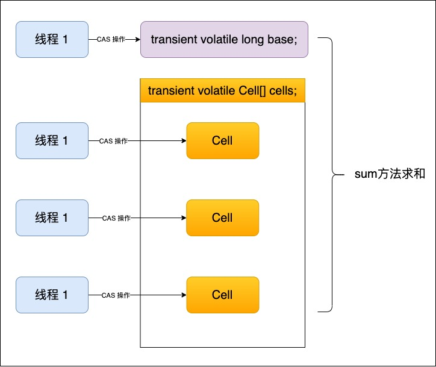

# Java Concurrent Util

## 线程基础知识

**JUC 四大口诀**

1. 高内聚低耦合前提下的封装思想。线程操作资源类。
2. 判断、干活、通知
3. 防止虚假唤醒，wait 方法要注意使用 while 判断
4. 注意标志位 flag，可能是 volatile 修饰的

<br>

 开始一个线程：Java 线程是通过 start() 方法启动执行的，主要内容在 native 的 start0() 方法中。Thread.java 对应的就是 Thread.c，start0() 其实就是 JVM_StartThread。

<br>

Java 多线程相关概念：

- 进程：是程序的一次执行，是系统进行资源分配和调度的独立单位，每一个进程都有它自己的内存空间和系统资源

- 线程：在同一个进程内，又可以执行多个任务，而每一个任务可以看做是一个线程；一个进程会有 1 和或多个线程的

- 管程：Monitor(监视器对象，管程对象)，就是我们平时说的锁。是一种同步器，它的义务是保证（同一时间）只有一个线程能够访问被保护的数据和代码。JVM 中的同步是基于进入和退出监视器对象 (Monitor，管程对象)来实现的，每个对象实例都会有一个 Monitor 对象。Monitor 对象会与 Java 对象一同创建和销毁，底层是由 C++语言来实现的。

  > JVM第三版 6.4.10 同步指令
  >
  > - Java 虚拟机可以支持方法级的同步和方法内部一段指令序列的同步，这两种同步结构都是使用管程（Monitor，更常见的是直接将它称为“锁”）来实现的。
  >
  > - 方法级的同步是隐式的，无需通过字节码指令来控制，它实现在方法调用和返回操作之中。虚拟机可以从方法常量池中的方法表结构中的 **ACC_SYNCHRONIZED** 访问标志得知一个方法是否被声明为同步方法。**当方法调用时，调用指令会检测方法的 ACC_SYNCHRONIZED 访问标志是否被设置，如果设置了，执行线程就要求先成功持有管程，然后才能执行方法，最后方法完成（无论是否正常完成）时释放管程。在方法执行期间，执行线程持有了管程，其它任何线程都无法再获取到同一个管程。**如果一个同步方法执行期间抛出了异常，并且在方法内部无法处理此异常，那这个同步方法所持有的管程将在异常抛到同步方法边界之外时自动释放。
  >
  > - 同步一段指令集序列通常是由 Java 语言中的 synchronized 语句块来表示的， Java 虚拟机的指令集中有 monitorenter 和 monitorexit 两条指令来支持 synchronized 关键字的语义，正确实现 synchronized 关键字需要 Javac 编译器与 Java 虚拟机两者共同协作支持。
  >
  > - 编译器必须确保无论方法通过何种方式完成，方法中调用过的每条 monitorenter 指令都必须执行器对应的 monitorexit 指令，而无论这个方法是正常结束还是异常结束。
  > - 为了保证方法在异常完成时，monitorenter 和 monitorexit 指令依然可以正确配对执行，编译器会自动产生一个异常处理器，这个异常处理器声明可以处理所有异常，它的目的就是用来执行 monitorexit 指令的。
  >
  > 

<br>

用户线程和守护线程：Java 线程分为用户线程和守护线程

- 守护线程：线程的 deamon 属性值为 true，表示是守护线程。是一种特殊的线程，在后台默默地完成一些系统性的服务，比如垃圾回收线程就是守护线程。
- 用户线程：线程的 deamon 属性值为 false，表示是用户线程。是系统工作线程，会完成这个程序需要完成的业务操作。**设置守护线程，需要在 start() 方法之前进行**。

> 当程序中所有用户线程执行完毕之后，不管守护线程是否结束，系统都会自动退出。如果用户线程全部结束了，意味着程序需要完成的业务操作已经结束了，系统可以退出了。所以，当系统只剩下守护线程的时候，Java 虚拟机就会自动退出。


---

## CompletableFuture

#### **Java 8 函数式编程的几个重要接口**

```java
// Runnable：无参数，无返回值
@FunctionalInterface
public interface Runnable {
    public abstract void run();
}

// Function：接收一个参数，有返回值
@FunctionalInterface
public interface Function<T, R> {
    R apply(T t);
}

// Consumer：接收一个参数，没有返回值
@FunctionalInterface
public interface Consumer<T> {
    void accept(T t);
}

// Supplier：无参数，有返回值
@FunctionalInterface
public interface Supplier<T> {
    T get();
}

// BiConsumer：接收两个参数，没有返回值
@FunctionalInterface
public interface BiConsumer<T, U> {
    void accept(T t, U u);
}
```

| 函数式接口名称 | 方法名称         | 参数     | 返回值   |
| -------------- | ---------------- | -------- | -------- |
| Runnable       | run()            | 无参数   | 无返回值 |
| Function       | apply(T t)       | 一个参数 | 有返回值 |
| Consumer       | accept(T t)      | 一个参数 | 无返回值 |
| Supplier       | get()            | 无参数   | 无返回值 |
| BiConsumer     | accept(T t, U u) | 两个参数 | 无返回值 |

<br>

#### Future 接口 和 Callable 接口

- Future 接口定义了操作异步任务执行的一些方法，如获取异步任务的执行结果、取消任务的执行、判断任务是否被取消、判断任务执行是否完成等。

- Callable 接口中定义了需要有返回的任务需要实现的方法。比如主线程让子线程去执行任务，子线程可能比较耗时，启动子线程开始执行任务后，主线程可以去做其它的操作，过一段时间，再去获取子线程任务的执行结果。

  ```java
  @FunctionalInterface
  public interface Callable<V> {
      V call() throws Exception;
  }
  ```

<br>

#### FutureTask


> A Future represents the result of an asynchronous computation. Methods are provided to check if the computation is complete, to wait for its completion, and to retrieve the result of the computation. The result can only be retrieved using method get when the computation has completed, blocking if necessary until it is ready. Cancellation is performed by the cancel method. Additional methods are provided to determine if the task completed normally or was cancelled. Once a computation has completed, the computation cannot be cancelled. If you would like to use a Future for the sake of cancellability but not provide a usable result, you can declare types of the form Future<?> and return null as a result of the underlying task.
>
> Future 表示异步计算的结果。提供了检查计算是否完成、等待计算完成以及检索计算结果的方法。结果只能在计算完成时使用方法 get 检索，必要时阻塞直到准备就绪。取消是通过 cancel 方法执行的。还提供了其他方法来确定任务是否正常完成或取消。一旦计算完成，就不能取消计算。如果您希望为了可取消性而使用 Future，但是没有提供可用的结果，那么可以声明 Future < ? > 表单的类型然后返回 null 作为底层任务的结果。
>
> FutureTask 的 get() 方法，是一个阻塞方法。一旦调用 get() 方法，不管是否计算完成，都会导致阻塞。
>
> FutureTask 的 isDone() 方法，采用的是轮询的方式查看计算结果，会消耗无畏的 CUP 资源，还不见得能够及时得到结算结果。如果想要异步获取结果，通常会以轮询的方式去获取结果，尽量不要使用阻塞的方式。

<br>

#### CompletableFuture


```java
public class CompletableFuture<T> implements Future<T>, CompletionStage<T> {}
```

CompletionStage：

- 代表异步计算过程中的某一个阶段，一个阶段完成以后可能会触发另一个阶段，有些类似 Linux 系统的管道分隔符传参数
- 一个阶段的计算执行可以是一个 Function、Consumer 或者 Runnable。
- 一个阶段的执行可能是被单个阶段的完成触发，也可能是由多个阶段一起触发

CompletableFuture：

- 在 Java 8 中，CompletableFuture 提供了非常强大的 Future 的扩展功能，可以帮助我们简化异步编程的复杂性，并且提供了函数式编程的能力，可以通过回调的方式处理计算结果，也提供了转换和组合 CompletableFuture 的方法
- 它可能代表一个明确完成的 Future，也可能代表一个完成阶段（CompletionStage），它支持在计算完成后触发一些函数或执行某些动作
- 它实现了 Future 接口和 CompletionStage 接口

<br>

#### CompletableFuture 的重要核心方法

- **runAsync：无返回值**

  ```java
  // 传参不含线程池，直接使用默认的 ForkJoinPool.commonPool() 作为它的线程池，执行异步代码
  public static CompletableFuture<Void> runAsync(Runnable runnable);
  // 传参含线程池，使用传入的线程池至此那个异步代码
  public static CompletableFuture<Void> runAsync(Runnable runnable,Executor executor);
  
  private static void runAsyncTest() throws InterruptedException, ExecutionException {
    CompletableFuture<Void> future = CompletableFuture.runAsync(() -> {
      System.out.println(Thread.currentThread().getName()+"\t"+"-----come in");
      //暂停几秒钟线程
      try { TimeUnit.SECONDS.sleep(1); } catch (InterruptedException e) { e.printStackTrace(); }
      System.out.println("-----task is over");
    });
    System.out.println(future.get());
  }
  
  /**
   * ForkJoinPool.commonPool-worker-9	-----come in
   * -----task is over
   * null
   */
  ```

- **supplyAsync：有返回值**

  ```java
  // 传参不含线程池，直接使用默认的 ForkJoinPool.commonPool() 作为它的线程池，执行异步代码
  public static <U> CompletableFuture<U> supplyAsync(Supplier<U> supplier);
  // 传参含线程池，使用传入的线程池至此那个异步代码
  public static <U> CompletableFuture<U> supplyAsync(Supplier<U> supplier,Executor executor);
  
  private static void supplyAsyncTest() throws InterruptedException, ExecutionException {
      CompletableFuture<Integer> completableFuture = CompletableFuture.supplyAsync(() -> {
          System.out.println(Thread.currentThread().getName() + "\t" + "-----come in");
          //暂停几秒钟线程
          try {
              TimeUnit.SECONDS.sleep(1);
          } catch (InterruptedException e) {
              e.printStackTrace();
          }
          return ThreadLocalRandom.current().nextInt(100);
      });
  
      System.out.println(completableFuture.get());
  }
  
  /**
   * ForkJoinPool.commonPool-worker-9	-----come in
   * 47
   */
  ```

- **异步任务结束后或发生异常后，回调某个对象的方法**

  ```java
  private static void callBackTest() {
      CompletableFuture<Integer> completableFuture = CompletableFuture.supplyAsync(() -> {
          System.out.println(Thread.currentThread().getName() + "\t" + "-----come in");
          int result = ThreadLocalRandom.current().nextInt(10);
          //暂停几秒钟线程
          try { TimeUnit.SECONDS.sleep(1); } catch (InterruptedException e) { e.printStackTrace(); }
          System.out.println("-----计算结束耗时1秒钟，result： "+result);
          if(result > 6)
          {
              // 模拟异常
              int age = 10/0;
          }
          return result;
      }).whenComplete((v,e) ->{ // 异步任务 supplyAsync 正常结束后，回调 whenComplete 方法
          if(e == null)
          {
              System.out.println("-----result: "+v);
          }
      }).exceptionally(e -> { // 异步任务 supplyAsync 发生异常后，回调 exceptionally 方法
          System.out.println("-----exception: "+e.getCause()+"\t"+e.getMessage());
          return -44;
      });
  
      //主线程不要立刻结束，否则CompletableFuture默认使用的线程池会立刻关闭:暂停3秒钟线程
      try { TimeUnit.SECONDS.sleep(3); } catch (InterruptedException e) { e.printStackTrace(); }
  }
  
  /**
   * 方法正常运行结果：
   * ForkJoinPool.commonPool-worker-9	-----come in
   * -----计算结束耗时1秒钟，result： 5
   * -----result: 5
   */
  
  /**
   * 方法发生异常后的结果
   * ForkJoinPool.commonPool-worker-9	-----come in
   * -----计算结束耗时1秒钟，result： 9
   * -----exception: java.lang.ArithmeticException: / by zero	java.lang.ArithmeticException: / by zero
   */
  ```

<br>

#### CompletableFuture 的优点

1. 异步任务结束时，会自动回调某个对象的方法
2. 异步任务出错时，会自动回调某个对象的方法
3. 主线程设置好回调后，不再关心异步任务的执行，异步任务之间可以顺序执行

<br>

#### CompletableFuture 的常用方法

**示例代码 → CompletableFutureDemo**

1. 获取计算结果和触发计算

   ```java
   // 阻塞式获取结果，直到获取到结果后才结束方法
   public T get();
   
   // 设置超时时间的阻塞式获取结果，若获取结果超时了，就结束方法
   public T get(long timeout, TimeUnit unit);
   
   // 立即获取结果，不阻塞，若方法没有计算完成，则返回设定的替代结果，若计算完成，直接返回计算结果
   public T getNow(T valueIfAbsent);
   
   // 阻塞式获取结果，但发生异常时，会抛出未经检查的异常，而 get() 方法会抛出经检查的异常，可以被捕获，自定义处理或直接抛出。
   public T join();
   
   /**
    * 主动触发计算。
    * 当 completableFuture.get() 时发生阻塞，complete 可以结束阻塞，立即返回 complete 面里面的值
    * 当 completableFuture.get() 时立即获取到结果，complete 不会触发计算
    */
   public boolean complete(T value);
   ```

2. 对计算结果进行处理

   ```java
   // 计算结果存在依赖关系，这两个线程串行化（当前步骤发生异常，不走下一步，哪步出错，就停在哪步）
   public <U> CompletableFuture<U> thenApply;
   
   // 计算结果存在依赖关系，这两个线程串行化（当前步骤发生异常，携带异常参数继续走下一步）
   public <U> CompletableFuture<U> handle;
   ```

   > whenComplete 和 whenCompleteAsync 的区别：
   >
   > - whenComplete：是执行当前任务的线程继续执行 whenComplete 的任务
   > - whenCompleteAsync：是将 whenCompleteAsync 这个任务继续提交给线程池来执行

3. 对计算结果进行消费

   ```java
   // 任务之间顺序执行
   // 任务 A 执行完毕后执行 B，并且 B 不需要 A 的结果
   public CompletableFuture<Void> thenRun(Runnable action);
   
   // 任务 A 执行完毕后执行 B，B 需要 A 的结果，但是任务 B 无返回值
   public CompletableFuture<Void> thenAccept(Consumer<? super T> action);
   
   // 任务 A 执行完毕后执行 B，B 需要 A 的结果，同时任务 B 有返回值
   public <U> CompletableFuture<U> thenApply;
   ```

4. 对计算速度进行选用

   ```java
   // 选取运行快的任务进行计算
   public <U> CompletableFuture<U> applyToEither;
   ```

5. 对计算结果进行合并

   ```java
   // 两个 CompletionStage 任务都完成后，最终能把两个任务的结果一起交给 thenCombine 来处理。先完成的先等着，等待其它分支任务
   public <U,V> CompletableFuture<V> thenCombine;
   ```


---

## LockSupport 与线程中断

#### 线程中断机制

线程中断：

- 一个线程不应该由其它线程来强制中断或停止，而是应该由线程自己自行停止，所以 Thread.stop()、Thread.suspend()、Thread.resume() 这些方法都已经被废弃了。
- 在 Java 中没有办法立即停止一条线程，然而停止线程却显得尤为重要，例如取消一个耗时操作，因此，Java 提供了一种用于停止线程的机制，中断。
- 中断只是一种协助机制，Java 没有给中断增加任何语法，中断的过程完全由开发者自己实现。
- 每个线程对象中有一个标识，用于标识线程是否被中断。该标识位为 true，表示中断；该标识位为 false，表示未中断。通过调用线程对象的 interrupt 方法将可以将该线程的标志位设置为 true；可以在其它线程中调用，也可以在自己的线程中调用.
- **若要中断一个线程，需要手动调用该线程的 interrupt 方法，该方法仅仅是将线程对象的中断标识设置成 true**，然后需要自行代码实现不断地检测当前线程的标识位，如果为 true，表示其它线程要求这条线程中断，后续逻辑需自行实现。

| 方法                                | 说明                                                         |
| ----------------------------------- | ------------------------------------------------------------ |
| public void interrupt()             | 实例方法，仅仅是设置线程的中断状态（标识位）为 true，不会立即停止线程 |
| public static boolean interrupted() | 静态方法，判断线程是否被中断，并清除当前中断状态。（底层传参 ClearInterrupted=true） |
| public boolean isInterrupted()      | 实例方法，（检测线程中断标识位）判断当前线程是否被中断。（底层传参 ClearInterrupted=false） |

<br>

使用中断标识停止线程：在需要中断的线程中不断监听中断状态标识位，一旦发生中断，就执行相应的中断处理业务逻辑。

1. 通过 volatile 变量实现

   ```java
   private static volatile boolean isStop = false;
   
   public static void main(String[] args) {
   
       new Thread(() -> {
           while(true)
           {
               if(isStop)
               {
                   System.out.println(Thread.currentThread().getName()+"线程------isStop = true,自己退出了");
                   break;
               }
               System.out.println("-------hello interrupt");
           }
       },"t1").start();
   
       //暂停几秒钟线程
       try { TimeUnit.SECONDS.sleep(1); } catch (InterruptedException e) { e.printStackTrace(); }
       isStop = true;
   }
   ```

2. 通过 AtomicBoolean实现

   ```java
   private final static AtomicBoolean atomicBoolean = new AtomicBoolean(true);
   
   public static void main(String[] args) {
   
       Thread t1 = new Thread(() -> {
           while(atomicBoolean.get())
           {
               try { TimeUnit.MILLISECONDS.sleep(500); } catch (InterruptedException e) { e.printStackTrace(); }
               System.out.println("-----hello");
           }
       }, "t1");
       t1.start();
   
       try { TimeUnit.SECONDS.sleep(3); } catch (InterruptedException e) { e.printStackTrace(); }
   
       atomicBoolean.set(false);
   }
   ```

3. 通过 Thread 的中断 API 方法实现

   ```java
   public static void main(String[] args) {
   
       Thread t1 = new Thread(() -> {
           while(true)
           {
               if(Thread.currentThread().isInterrupted())
               {
                   System.out.println("-----t1 线程被中断了，break，程序结束");
                   break;
               }
               System.out.println("-----hello");
           }
       }, "t1");
       t1.start();
   
       System.out.println("**************"+t1.isInterrupted());
       //暂停5毫秒
       try { TimeUnit.MILLISECONDS.sleep(5); } catch (InterruptedException e) { e.printStackTrace(); }
     
     	// interrupt()：无返回值
       t1.interrupt();
     	// isInterrupted()：有返回值
       System.out.println("**************"+t1.isInterrupted());
   
   }
   ```

<br>

**interrupt() 方法说明：**

- 当一个线程调用 interrupt() 方法时，如果线程处于正常活动状态，那么会将该线程的中断标识位设置为 true，仅此而已。被设置中断标识的线程将继续正常运行，不受影响。所以 interrupt() 方法并不能真正的中断线程，需要被调用的线程自己进行配合才行；

- 如果线程处于被阻塞状态（例如处于 sleep、wait、join 等状态），此时在其它线程中调用当前线程对象的 interrupt() 方法，那么线程将立即退出被阻塞状态，并抛出一个 InterruptedException 异常。sleep() 方法抛出 InterruptedException 后，中断标识也被清空，置为 false。若在 catch 中没有再次使用 interrupt() 方法，将中断标识位再次设置为 true 的话，将导致程序无法停止，导致无限循环下去了

  ```java
  public static void main(String[] args) {
  
      Thread t1 = new Thread(() -> {
          while (true){
              if (Thread.currentThread().isInterrupted()){
                  System.out.println(Thread.currentThread().getName() + "线程----→ isInterrupted()=true，自己退出了");
                  break;
              }
              try {
                  TimeUnit.MILLISECONDS.sleep(20);	
              }catch (Exception e){
                  // 若没有 Thread.currentThread().interrupt()，程序将不会停止，因为 sleep() 抛出异常后，将中断标志位设置为 false
                  // Thread.currentThread().interrupt();
                  e.printStackTrace();
              }
              System.out.println("===测试===");
          }
      },"t1");
      t1.start();
  
      try { TimeUnit.MILLISECONDS.sleep(100); } catch (InterruptedException e) { e.printStackTrace(); }
      t1.interrupt();
  }
  ```

- 静态 interrupted() 方法。Thread.interrupted()：作用是测试当前线程是否被中断（检查中断标识位），返回一个 boolean，并清除中断状态。第二次再调用时，中断状态已经被清除，将返回一个 false。

  ```java
  public static void main(String[] args) {
  
      System.out.println(Thread.currentThread().getName()+"---"+Thread.interrupted());
      System.out.println(Thread.currentThread().getName()+"---"+Thread.interrupted());
      System.out.println("111111");
      Thread.currentThread().interrupt();
      System.out.println("222222");
      System.out.println(Thread.currentThread().getName()+"---"+Thread.interrupted());
      System.out.println(Thread.currentThread().getName()+"---"+Thread.interrupted());
  }
  ```

  > isInterrupted() 方法和静态 interrupted() 方法的对比都是判断线程是否被中断，但是 isInterrupted() 方法不会清除中断标识，而 interrupted() 方法会清空中断标识。
  >
  > 因为这两个方法都是调用同一个方法 private native boolean isInterrupted(boolean ClearInterrupted)，只不过传入的参数的值不一样
  >
  > isInterrupted() ：传入的参数是 ClearInterrupted=false，即不清楚中断标识位
  >
  > static interrupted()：传入的参数是 ClearInterrupted=true，即清楚中断标识位

<br>

#### LockSupport

LockSupport 和 CAS 是 Java 并发包中很多并发工具控制机制的基础，它们底层其实都是依赖 Unsafe 实现。

Concurrent 包是基于 AQS (AbstractQueuedSynchronizer) 框架，AQS 框架借助于两个类：Unsafe(提供 CAS 操作) 和 LockSupport(提供 park/unpark 操作)。因此，LockSupport 可谓构建 Concurrent包的基础之一。

LockSupport 是一个线程阻塞工具类，所有的方法都是静态方法，可以让线程在任意位置阻塞，当然阻塞之后肯定得有唤醒的方法。归根结底，LockSupport 调用的 Unsafe 中的native 代码。

LockSupport 是用来创建锁和其他同步类的基本**线程阻塞**原语。LockSupport 提供 park() 和 unpark() 方法实现阻塞线程和解除线程阻塞，LockSupport 和每个使用它的线程都有一个许可(permit)关联。permit 相当于 1，0 的开关，默认是 0，调用一次 unpark 就加 1 变成 1，调用一次 park 会消费 permit，也就是将 1 变成 0，同时 park 立即返回。再次调用 park会变成 block（因为 permit 为 0 了，会阻塞在这里，直到 permit 变为 1），这时调用 unpark 会把 permit 置为 1。每个线程都有一个相关的 permit，permit 最多只有一个，重复调用 unpark 也不会积累。

park() 和 unpark() 不会有 `Thread.suspend` 和 `Thread.resume` 所可能引发的死锁问题，由于许可的存在，调用 park 的线程和另一个试图将其 unpark 的线程之间的竞争将保持活性。

如果调用线程被中断，则park方法会返回。同时park也拥有可以设置超时时间的版本。

```java
// 给线程 t 设置阻塞对象为 arg，以便出问题时排查阻塞对象，这个方法为私有方法，其他 park 的静态方法会调用这个方法设置 blocker
private static void setBlocker(Thread t, Object arg)
// 获取线程 t 的阻塞对象，一般用于排查问题
public static Object getBlocker(Thread t);

// 暂停当前线程
public static void park(Object blocker);
// 暂停当前线程，不过有超时时间的限制
public static void parkNanos(Object blocker, long nanos);
// 暂停当前线程，直到某个时间
public static void parkUntil(Object blocker, long deadline);
// 无期限暂停当前线程
public static void park();
// 暂停当前线程，不过有超时时间的限制
public static void parkNanos(long nanos);
// 暂停当前线程，直到某个时间
public static void parkUntil(long deadline);
// 恢复当前线程
public static void unpark(Thread thread);
```

<br>

**线程等待和唤醒的方式：**

1. **wait 和 notify**：使用 Object 的 wait() 方法让线程等待；使用 Object 的 notify() 方法唤醒线程；
- **Object 类中的 wait、notify、notifyAll 必须在 synchronized 内部使用（同步代码块内或同步方法内），否则会抛出异常 IllegalMonitorStateException。**
  
- **Object 类中的 wait() 方法必须在 notify() 方法前运行，否则会造成等待中的线程无法被唤醒，程序无法结束。**
2. **await 和 signal**：使用 JUC 包中 Condition 的 await() 方法让线程等待；使用 signal() 方法唤醒线程。
   - Condition 类的 await()、signal() 方法必须在 lock() 和 unlock() 内使用，否则会抛出异常 IllegalMonitorStateException。即有锁才能调用。
   - Condition 类的 await() 方法必须在 signal() 方法前运行，否则会造成阻塞的线程无法被唤醒，程序无法结束。即要先等待再唤醒
3. **park 和 unpar**：使用 LockSupport 的 park() 方法阻塞线程，使用 unpark() 方法唤醒被阻塞的线程
   - park() /park(Object blocker)  ：阻塞当前线程/阻塞传入的具体线程。permit 默认值是 0，所以一开始调用 park() 方法时，当前线程就会阻塞，直到其它线程将当前线程的 permit 的值设置为 1 时，park 方法就会被唤醒，然后会将 permit 的值再次设置为 0 并返回；
   - unpark(Thread thread)：唤醒处于阻塞状态的指定线程。调用后，就会将指定的 thread 线程的许可 permit 的值设置成 1（多次调用 unpark 方法，permit 值不会累加，permit 值还是 1），会自动唤醒该类，即之前被阻塞的 LockSupport.park() 方法会立即返回
   - park() 和 unpark() 方法的使用无锁块要求
   - park() 和 unpark() 方法的使用无顺序要求
   - park() 和 unpark() 方法的使用必须成对使用

<br>

HotSpot 的源码，每个 java 线程都有一个 Parker 实例，Parker 类是这样定义的：

```java
class Parker : public os::PlatformParker {  
private:  
  volatile int _counter ;  
  ...  
public:  
  void park(bool isAbsolute, jlong time);  
  void unpark();  
  ...  
}  
class PlatformParker : public CHeapObj<mtInternal> {  
  protected:  
    pthread_mutex_t _mutex [1] ;  
    pthread_cond_t  _cond  [1] ;  
    ...  
}
```

LockSupport就是通过控制变量 `_counter`来对线程阻塞唤醒进行控制的。原理有点类似于信号量机制。

- 当调用 `park()`方法时，会将  _counter 置为 0，同时判断前值 < 1 说明前面被 `unpark`过，则直接退出，否则将使该线程阻塞。
- 当调用 `unpark()`方法时，会将  _counter 置为 1，同时判断前值 < 1 会进行线程唤醒，否则直接退出。
  形象的理解，线程阻塞需要消耗凭证(permit)，这个凭证最多只有 1 个。当调用 park 方法时，如果有凭证，则会直接消耗掉这个凭证然后正常退出；但是如果没有凭证，就必须阻塞等待凭证可用；而 unpark 则相反，它会增加一个凭证，但凭证最多只能有 1 个。
- 为什么可以先唤醒线程后阻塞线程？
  因为 unpark 获得了一个凭证，之后调用 park，因为有凭证消费，故不会阻塞。
- 为什么唤醒两次后阻塞两次会阻塞线程。
  因为凭证的数量最多为 1，连续调用两次 unpark 和调用一次 unpark 效果一样，只会增加一个凭证；而调用两次 park 却需要消费两个凭证。

<br>

总结

LockSupport.park() 和 unpark() 和 object.wait() 和 notify() 很相似，那么它们有什么区别呢？

1. 面向的主体不一样。LockSuport 主要是针对 Thread 进行阻塞处理，可以指定阻塞队列的目标对象，每次可以指定具体的线程唤醒。Object.wait() 是以对象为纬度，阻塞当前的线程和唤醒单个或所有线程。
2. 实现机制不同。两者的阻塞队列并不交叉。也就是说 `unpark ` 不会对 `wait `起作用，`notify `也不会对 `park `起作用。object.notifyAll() 不能唤醒 LockSupport 的阻塞 Thread。

LockSupport 是 JDK 中用来实现线程阻塞和唤醒的工具。使用它可以在任何场合使线程阻塞，可以指定任何线程进行唤醒，并且不用担心阻塞和唤醒操作的顺序，但要注意连续多次唤醒的效果和一次唤醒是一样的。

---

## Java 内存模型之 JMM

计算机存储结构，从本地磁盘到主内存，再到 CPU 缓存，也就是从硬盘到内存，再到 CPU。一般对应的程序的操作就是从数据库查数据到内存然后再到 CPU 进行计算。

因为有多级缓存（CPU 和物理主内存的速度不一致），CPU 的运行并不是直接操作主内存，而是先把主内存中的数据读取到高速缓存中，而内存的读和写操作的时候就会造成不一致的问题。

Java 虚拟机规范中试图定义一种 Java 内存模型（Java Memory Model，简称 JMM）来屏蔽掉各种硬件和操作系统的内存访问差异，以实现让 Java 程序在各种平台下都能达到一致的内存访问效果。

JMM（Java 内存模型 Java Memory Model，简称 JMM），本身是一种抽象的概念，并不真实存在。它仅仅描述的是一组约定或规范，通过这组规范定义了程序中（尤其是多线程）各个变量的读写访问方式，并决定一个线程对共享变量的写入何时以及如何变成对另一个线程可见，**关键技术点都是围绕多线程的原子性、可见性和有序性展开的**。

- 通过 JMM 来实现线程和主内存之间的抽象关系
- 屏蔽各个硬件平台和操作系统的内存访问差异，以实现 Java 程序在各种平台下都能到达到一直的内存访问效果。

<br>

JMM 三大特性

1. 可见性：指当一个线程修改了某一个共享变量的值，其它线程是否能否立即察觉到该变更。

   

   > Java中普通的共享变量不保证可见性，因为数据修改被写入内存的时机是不确定的，多线程并发下很可能出现"脏读"，所以每个线程都有自己的**工作内存**，线程自己的工作内存中保存了该线程使用到的变量的主内存副本拷贝，线程对变量的所有操作（读取，赋值等 ）都必需在线程自己的工作内存中进行，而不能够直接读写主内存中的变量。不同线程之间也无法直接访问对方工作内存中的变量，线程间变量值的传递均需要通过主内存来完成。

2. 原子性：指一个操作是不可中断的，即多线程环境下，操作不能被其它线程干扰

3. 有序性：对于一个线程的执行代码而言，我们总是习惯性认为代码的执行总是从上到下，有序执行。但为了性能，编译器和处理器通常会对指令序列进行重新排序。指令重排可以保证串行语义一致，但没有义务保证多线程间的语义也一致，即可能产生"脏读"，简单说，两行以上不相干的代码在执行的时候有可能先执行的不是第一条，不见得是从上到下顺序执行，执行顺序会被优化。

   

   - 单线程环境里面确保程序最终执行结果和代码顺序执行的结果一致。处理器在进行重排序时必须要考虑指令之间的**数据依赖性**。

   - 多线程环境中线程交替执行，由于编译器优化重排的存在，两个线程中使用的变量能否保证一致性是无法确定的,结果无法预测。

<br>

JMM 规范下，多线程对变量的读写过程：由于JVM运行程序的实体是线程，而每个线程创建时，JVM 都会为其创建一个工作内存(有些地方称为栈空间)，工作内存是每个线程的私有数据区域，而 Java 内存模型中规定所有变量都存储在主内存，主内存是共享内存区域，所有线程都可以访问。但线程对变量的操作(读取赋值等)必须在工作内存中进行，首先要将变量从主内存拷贝到的线程自己的工作内存空间，然后对变量进行操作，操作完成后再将变量写回主内存，不能直接操作主内存中的变量，各个线程中的工作内存中存储着主内存中的**变量副本拷贝**，因此不同的线程间无法访问对方的工作内存，线程间的通信(传值)必须通过主内存来完成，其简要访问过程如下图:


> 我们定义的所有共享变量都储存在物理主内存中
>
> 每个线程都有自己独立的工作内存，里面保存该线程使用到的变量的副本(主内存中该变量的一份拷贝)
>
> 线程对共享变量所有的操作都必须先在线程自己的工作内存中进行后写回主内存，不能直接从主内存中读写(不能越级)
>
> 不同线程之间也无法直接访问其他线程的工作内存中的变量，线程间变量值的传递需要通过主内存来进行(同级不能相互访问)

<br>

JMM 规范下，多线程先行发生原则（happens-before）

- 如果一个操作 happens-before 另一个操作，那么第一个操作的执行结果将对第二个操作可见，而且第一个操作的执行顺序排在第二个操作之前。
- 两个操作之间存在happens-before关系，并不意味着一定要按照happens-before原则制定的顺序来执行。如果重排序之后的执行结果与按照happens-before关系来执行的结果一致，那么这种重排序并不非法。

<br>

happens-before 的 8 条规则

1. 次序规则：一个线程内，按照代码顺序，写在前面的操作先行发生于写在后面的操作。前一个操作的结果可以被后续的操作获取。例如前面一个操作把变量 X 赋值为 1，那后面一个操作肯定能知道 X 已经变成了 1。
2. 锁定规则：一个 unLock 操作先行发生于后面((这里的“后面”是指时间上的先后))对同一个锁的 lock 操作；
3. volatile 变量规则：对一个 volatile 变量的写操作先行发生于后面对这个变量的读操作，前面的写对后面的读是可见的，这里的“后面”同样是指时间上的先后。
4. 传递规则：如果操作 A 先行发生于操作 B，而操作 B 又先行发生于操作 C，则可以得出操作 A 先行发生于操作 C；
5. 线程启动规则（Thread Start Rule）：Thread 对象的 start() 方法先行发生于此线程的每一个动作
6. 线程中断规则（Thread Interruption Rule）：对线程 interrupt() 方法的调用先行发生于被中断线程的代码检测到中断事件的发生；即先中断，然才能检测到线程的中断。
7. 线程终止规则（Thread Termination Rule）：线程中的所有操作都先行发生于对此线程的终止检测，我们可以通过 Thread::join() 方法是否结束、Thread::isAlive() 的返回值等手段检测线程是否已经终止执行。
8. 对象终结规则（Finalizer Rule）：一个对象的初始化完成（构造函数执行结束）先行发生于它的 finalize() 方法的开始。即对象没有完成初始化之前，是不能调用finalized()方法的。

---

## Java 内存模型之 volatile

volatile 的内存语义

- 当写一个 volatile 变量时，JMM 会把该线程对应的本地内存中的共享变量值立即刷新回主内存中。
- 当读一个 volatile 变量时，JMM 会把该线程对应的本地内存设置为无效，然后再直接从主内存中读取共享变量
- 所以 volatile 的写内存语义是直接刷新到主内存中，读内存语义是直接从主内存中读取。

<br>

内存屏障（Memory Barriers / Fences）：

- 也称之为内存栅栏，内存栅障， 屏障指令等，是一类同步屏障指令，使得 CPU 或编译器对屏障指令的**前**面和**后**面所发出的内存操作执行一个排序的约束。**内存屏障其实就是一种 JVM 指令，Java 内存模型的重排规则会要求 Java 编译器在生成 JVM 指令时，插入特定的内存屏障指令，通过这些内存屏障指令，volatile 实现了 Java 内存模型中的可见性和有序性，但 volatile 无法保证原子性。**
- 可以阻止屏障两边的指令重排
- 写数据时加入内存屏障，可以强制将线程私有的工作内存中的数据刷回主内存
- 读数据时加入内存平展，可以将线程私有工作内存中的数据失效，重新到主内存中读取最新的数据

>  volatile 会在 Class 的内部的 Field 的 flags 添加一个 ACC_VOLATILE。JVM 在将字节码生成机器码的时候，当检测到操作是使用 volatile 修饰的话，就会根据 JMM 要求，在相应的位置插入内存屏障指令。

<br>

JVM 中提供了四类内存屏障指令

| 屏障类型   | 指令示例                   | 说明                                                         |
| ---------- | -------------------------- | ------------------------------------------------------------ |
| LoadLoad   | Load1；LoadLoad；Load2     | 保证 Load1 的读操作在 Load2 之前执行                         |
| StoreStore | Store1；StoreStore；Store2 | 在 Store2 及其后的写操作执行前，保证 Store1 的写操作已经刷新到主内存 |
| LoadStore  | Load1；LoadStore；Store2   | 在 Store2 及其后的写操作执行前，保证 Load1 的读操作已经读取结束 |
| StoreLoad  | Store1；StoreLoad；Load2   | 保证 Store1的写操作已经刷新到主内存之后，Load2 及其后的读操作才能执行 |

- 写
  - 在每一个 volatile 写操作的前面插入一个StoreStore 屏障
  - 在每一个 volatile 写操作后面插入一个 StoreLoad 屏障
- 读
  - 在每一个 volatile 读操作的后面插入一个 LoadLoad 屏障
  - 在每一个 volatile 读操作的后面插入一个 LoadStore 屏障

<br>

happens-before 之 volatile 变量规则：

| 第一个操作  | 第二个操作：普通读写 | 第二个操作：volatile 读 | 第二个操作 volatile 写 |
| ----------- | -------------------- | ----------------------- | ---------------------- |
| 普通读写    | 可以重排             | 可以重排                | 不可以重排             |
| volatile 读 | 不可以重排           | 不可以重排              | 不可以重排             |
| volatile 写 | 可以重排             | 不可以重排              | 不可以重排             |

- 当第一个操作为 volatile 读时，不论第二个操作是什么，都不能重排序。这个操作保证了 volatile 读之后的操作不会被重排的 volatile 读之前。
- 当第二个操作为 volatile 写时，不论第一个操作是什么，都不能重排序。这个操作保证了 volatile 写之前的操作不会被重排的 volatile 写之后。
- 当第一个操作为 volatile 写时，第二个操作为 volatile 时，不能重排。

<br>

volatile 的可见性：保证不同线程对这个变量进行操作时的可见性，即变量一旦改变，所有线程立即可见。

- 对一个 volatile 修饰的变量进行读操作的话，总能够读取到这个变量的最新的值，也就是这个变量最后被修改的值
- 一个线程修改了 volatile 修饰的变量的值时候，那么这个变量的新值会立即刷新回主内存
- 一个线程去读取 volatile 修饰的变量的值的时候，该变量在工作内存中的数据无效，需要重新到主内存中取读取最新的数据

- Java 内存模型中定义的 8 种内存与主内存之间的原子操作：**read(读取)、load(加载)、use(使用)、assign(赋值)、store(存储)、write(写入)、lock(锁定)、unlock(解锁)**

  

  > read：作用于主内存，将变量的值从主内存传输到工作内存，即主内存到工作内存
  >
  > load：作用于工作内存，将主内内存传输过来的变量值放入到工作内存变量副本中，即数据加载
  >
  > use：作用于工作内存，将工作内存遍历副本的值传递给执行引擎，每当 JVM 遇到需到这个变量的字节码指令时就会执行该操作
  >
  > assign：作用于工作内存，将从执行引擎接收到的值赋值给工作内存变量副本，每当 JVM 遇到一个给变量赋值的字节码指令时就会执行该操作
  >
  > store：作用于工作内存，将赋值完毕的工作变量的值写回主内存
  >
  > write：作用于主内存，将 store 传输过来的变量赋值给主内存中的变量
  >
  > 由于上述操作只能保证单条指令的原子性，但对于多条指令组合的原子性，由于没有大面积加锁，所以 JVM 提供了另外两个原子指令：
  >
  > lock：作用于主内存，将一个变量标记为一个线程独占的状态，只是写的时候加锁，即只锁了写变量的过程
  >
  > unlock：作用于主内存，把一个处于锁定状态的变量释放，然后才能被其它线程占用。

<br>

volatile 的有序性，禁止指令重排

- 重排序是指编译器和处理器为了优化程序性能而对指令序列进行重新排序的一种手段，有时候会改变程序语句的先后顺序。

- 对于不存在数据依赖关系的语句，可以重排序，但重排后的指令决不能改变原有的串行语义；对于存在数据依赖关系的语句，禁止重排序。

- **volatile 底层是通过内存屏障实现禁止指令重排序的**

- volatile 写之前的操作，都禁止重排序到 volatile 之后

  

- volatile 读之后的操作，都禁止重排序到 volatile 之前

  


<br>

volatile 的不保证原子性

<br>

volatile 的使用场景

- 单一赋值可以使用，但对于含复合运算的赋值操作不可以使用，例如 i++
- 状态标志，例如判断业务是否结束
- 针对读多余写的场景，volatile 结合内部锁一起使用，减少同步的开销。volatile 保证读取操作的可见性，synchronized 保证复合操作的原子性。

---

## CAS

#### CAS

CAS - compare and swap，它是一条 CPU 并发原语。它包含三个操作数，内存位置、预期原值以及更新值。在执行 CAS 操作的时候，将内存位置的值与预期原值比较：

- 如果相匹配，那么处理器会自动将该位置的值更新为新值
- 如果不匹配，处理器不做任何操作，多线程同时执行 CAS 操作时，只有一个会成功

**CAS 是 JDK 提供的非阻塞原子性操作**，它通过硬件保证了比较-更新的原子性。CAS 是一条 CPU 的原子指令（cmpxchg指令），不会造成所谓的数据不一致问题，Unsafe 类提供的 CAS 方法（例如 compareAndSwapXXX），在 intel 的 CPU 中(X86机器上)，底层实现使用的是汇编指令 cmpxchg 指令。执行 cmpxchg 指令的时候，会判断当前系统是否为多核系统，如果是，就给总线加锁，只有一个线程会对总线加锁成功，加锁成功之后会执行 CAS 操作，也就是说 CAS 的原子性实际上是 CPU 实现的，其实在这一点上还是有排他锁的，只是比起用 synchronized， 这里的排他时间要短的多，所以在多线程情况下性能会比较好。

CAS 并发原语体现在 JAVA 语言中就是 sun.misc.Unsafe 类中的各个方法。调用 UnSafe 类中的 CAS 方法，JVM 会帮我们实现出 CAS 汇编指令。这是一种完全依赖于硬件的功能，通过它实现了原子操作。再次强调，由于 CAS 是一种系统原语，原语属于操作系统用语范畴，是由若干条指令组成的，用于完成某个功能的一个过程，并且原语的执行必须是连续的，在执行过程中不允许被中断，也就是说 CAS 是一条 CPU 的原子指令，不会造成所谓的数据不一致问题。

<br>

#### Unsafe

Unsafe 是 CAS 的核心类，由于 Java 方法无法直接访问底层系统，需要通过本地（native）方法来访问，Unsafe 相当于一个后门，基于该类可以直接操作特定内存的数据。Unsafe 类存在于 sun.misc 包中，其内部方法操作可以像 C 的**指针**一样直接操作内存，因为 Java 中 CAS 操作的执行依赖于 Unsafe 类的方法。**注意 Unsafe 类中的所有方法都是 native 修饰的，也就是说 Unsafe 类中的方法都直接调用操作系统底层资源执行相应任务。**

```java
// 以 AtomicInteger 为例
public class AtomicInteger extends Number implements java.io.Serializable {
  private static final long serialVersionUID = 6214790243416807050L;

  // setup to use Unsafe.compareAndSwapInt for updates
  // Unsafe 类
  private static final Unsafe unsafe = Unsafe.getUnsafe();
  // 变量 valueOffset，表示该变量值在内存中的偏移地址，因为 Unsafe 就是根据内存偏移地址获取数据的。
  private static final long valueOffset;

  static {
    try {
      valueOffset = unsafe.objectFieldOffset
        (AtomicInteger.class.getDeclaredField("value"));
    } catch (Exception ex) { throw new Error(ex); }
  }

  // 变量 value 用 volatile 修饰，保证了多线程之间的内存可见性。
  private volatile int value;


  public final int getAndIncrement() {
    return unsafe.getAndAddInt(this, valueOffset, 1);
  }
 }
```

```java
// OpenJDK 源码，Unsafe.java unsafe.getAndAddInt(this, valueOffset, 1);
public final int getAndAddInt(Object o, long offset, int delta) {
  int v;
  do {
    v = this.getIntVolatile(o, offset);
  } while(!this.compareAndSwapInt(o, offset, v, v + delta));

  return v;
}
```

> 假设线程 A 和线程 B 两个线程同时执行 getAndAddInt 操作（分别跑在不同 CPU 上）：
>
> 1. AtomicInteger 里面的 value 原始值为 3，即主内存中 AtomicInteger 的 value 为 3，根据 JMM 模型，线程 A 和线程 B 各自持有一份值为 3 的 value 的副本分别到各自的工作内存；
> 2. 线程 A 通过 getIntVolatile(var1, var2) 拿到 value 值 3，这时线程 A 被挂起；
> 3. 线程 B 也通过 getIntVolatile(var1, var2) 方法获取到 value 值 3，此时刚好线程 B 没有被挂起并执行 compareAndSwapInt 方法比较内存值也为 3，成功修改内存值为 4，线程 B 执行完成；
> 4. 这时线程 A 恢复，执行 compareAndSwapInt 方法比较，发现自己手里的值数字 3 和主内存的值数字 4 不一致，说明该值已经被其它线程抢先一步修改过了，那 A 线程本次修改失败，只能重新读取主内存中变量的值，再重新计算；
> 5. 线程 A 重新获取 value 值，因为变量 value 被 volatile 修饰，所以其它线程对它的修改，线程 A 总是能够看到，线程 A 继续执行 compareAndSwapInt 进行比较替换，直到成功。

<br>

#### 自旋锁

自旋锁是指尝试获取锁的线程不会立即阻塞，而是采用**循环的方式**去尝试获取锁，当线程发现锁被占用时，会不断循环判断锁的状态，直到获取到锁。这样的好处是**减少线程上下文切换**的消耗，缺点是循环会消耗 CPU 资源。

```java
// 以 Unsafe 类的 getAndAddInt 方法为例
public final int getAndAddInt(Object o, long offset, int delta) {
  int v;
  do {
    v = this.getIntVolatile(o, offset);
  } while(!this.compareAndSwapInt(o, offset, v, v + delta));

  return v;
}
```

> getAndAddInt 方法采用的是 do-while 循环，如果 CAS 失败，会一直尝试。如果 CAS 长时间一直不成功，可能会给 CPU 带来很大的开销。

<br>

#### ABA 问题

CAS 会导致“ABA问题”。CAS 算法实现一个重要前提需要取出内存中某时刻的数据并在当下时刻比较并替换，那么在这个时间差类会导致数据的变化。比如说一个线程 one 从内存位置V 中取出 A，这时候另一个线程 two 也从内存中取出 A，并且线程 two 进行了一些操作将值变成了 B，然后线程 two 又将 V 位置的数据变成 A，这时候线程 one 进行 CAS 操作发现内存中仍然是 A，然后线程 one 操作成功。尽管线程 one 的 CAS 操作成功，但是不代表这个过程就是没有问题的。可以使用版本号时间戳原子引用 AtomicStampedReference 解决，也可以使用原子更新带有标记位的原子类 AtomicMarkableReference 解决。

---

## 原子操作

#### 基本类型原子类

- AtomicInteger、AtomicBoolean、AtomicLong
- 常用 API
  - public final int get()：获取当前的值
  - public final int getAndSet(int newValue)：获取当前的值，并设置新的值
  - public final int getAndIncrement()：获取当前的值，并自增
  - public final int getAndDecrement() ：获取当前的值，并自减
  - public final int getAndAdd(int delta) ：获取当前的值，并加上预期的值
  - boolean compareAndSet(int expect, int update)：如果输入的数值等于预期值，则以原子方式将该值设置为输入值（update）

<br>

#### 数组类型原子类

- AtomicIntegerArray、AtomicLongArray、AtomicReferenceArray

<br>

#### 原子引用类

- AtomicReference

- AtomicStampedReference：携带版本号的引用类型原子类，可以解决 ABA 问题

  ```java
  AtomicStampedReference atomicStampedReference = new AtomicStampedReference(100,1);
  int stamp = atomicStampedReference.getStamp();
  
  atomicStampedReference.compareAndSet(100,101,stamp,stamp+1);
  atomicStampedReference.compareAndSet(101,100,atomicStampedReference.getStamp(),
          atomicStampedReference.getStamp()+1);
  ```

- AtomicMarkableReference：原子更新带有标记位的原子类。它的订阅就是将状态戳简化为 true 和 false。

<br>

#### 对象的属性修改原子类

- AtomicIntegerFieldUpdater：原子更新对象中int类型字段的值

- AtomicLongFieldUpdater：原子更新对象中Long类型字段的值

- AtomicReferenceFieldUpdater：原子更新引用类型字段的值

  > 使用目的：以一种线程安全的方式操作非线程安全对象内的某些字段。
  >
  > 使用要求：
  >
  > - 更新的对象属性必须使用 public volatile 修饰符。
  > - 因为对象的属性修改类型原子类都是抽象类，所以每次使用都必须使用静态方法 newUpdater() 创建一个更新器，并且需要设置想要更新的类和属性

<br>

#### 原子操作增强类原理深度解析

- DoubleAccumulator、DoubleAdder、LongAccumulator、**LongAdder**

- LongAdder 常用 API

  | 方法名              | 方法说明                                                     |
  | ------------------- | ------------------------------------------------------------ |
  | void add(long x)    | 将当前的 value 加 x                                          |
  | void increment()    | 将当前的 value 加 1                                          |
  | void decrement()    | 将当前的 value 减 1                                          |
  | long sum()          | 返回当前 value 值。在不存在并发更新 value 的情况下，sum 会返回一个精确值；在存在并发更新 value 的情况下，sum 不保证返回精确值 |
  | void reset()        | 将 value 重置为 0。可用于替代重新 new 一个 LongAdder，但此方法只可以在没有并发更新的情况下使用 |
  | long sumThenReset() | 获取当前 value 值，并重置当前 value 值为 0                   |

- LongAdder 只能用来计算加法，且从零开始计算

- LongAccumulator 提供了自定义的函数操作。构造器传参需传入一个 function 的函数操作和操作的初始值

- LongAdder 的计算性能高

  ```txt
  costTime: 1558 毫秒	 number++	 clickBySync result: 50000000
  costTime: 3731 毫秒	 atomicLong.incrementAndGet()	 clickByAtomicLong result: 50000000
  costTime: 313 毫秒	 longAdder.increment()	 clickByLongAdder result: 50000000
  costTime: 635 毫秒	 longAccumulator.accumulate(1)	 clickByLongAccumulator result: 50000000
  ```

<br>

##### LongAdder 架构


> LongAdder 是 Striped64 的子类。
>
> 阿里 Java 开发手册：**对于多写多读的 count++ 操作，推荐使用 JDK 8 的 LongAdder 对象，比 AtomicLong 性能更好（减少乐观锁的重试次数）**。

<br>

##### Striped64 几个重要的成员函数

```java
// 当前计算器 CPU 数量，Cell 数组扩容时会用到
static final int NCPU = Runtime.getRuntime().availableProcessors();

// ⭐️⭐️⭐️⭐️⭐️ cells 数组，为 2 的幂，2,4,8,16.....，方便以后位运算。
transient volatile Cell[] cells;

// Cell 是 Striped64 的一个内部类
@sun.misc.Contended static final class Cell {}

/**
 * ⭐️⭐️⭐️⭐️⭐️
 * 类似于 AtomicLong 中全局的 value 值。在没有竞争情况下数据直接累加到 base 上，
 * 或者 cells 扩容时，也需要将数据写入到 base 上
 */
transient volatile long base;

/**
 * 初始化 cells 或者扩容 cells 需要获取锁
 * 0 表示无锁状态；1 表示其它线程已经持有了锁
 */
transient volatile int cellsBusy;

// 表示扩容意向；false：一定不会扩容，true：可能会扩容
boolean collide;

// 通过 CAS 操作修改 cellsBusy 的值，CAS 成功代表获取锁，返回 true
final boolean casCellsBusy();

// 获取当前线程的 hash 值
static final int getProbe();

// 重置当前线程的 hash 值
static final int advanceProbe(int probe);
```

<br>

##### LongAdder 原理

- LongAdder 的基本思路就是分散热点，将 value 值分散到一个 Cell 数组中，不同线程会命中到数组的不同槽中，各个线程对自己槽中的那个值进行 CAS 操作，这样热点就被分散了，冲突的概率就小很多。如果要获取真正的 long 值，只要将各个槽中的变量值累加返回即可。

- base 变量，在非竞态条件下，直接累加到该变量上。

- Cells[] 数组，在竞态条件下，累加各个线程自己的槽中的值，即 Cell[i]
- sum() 函数会将所有的 Cell 数组中的 value 和 base 累加作为返回值，核心思想就是将之前 AtmoicLong 中的一个 value 的更新压力分散到过个 value 中去，从而降低更新热点。


$$
数学表达式：value = base + \sum_{i=0}^{n}{Cells[i]}
$$
<br>

##### LongAdder 源码

LongAdder 在无竞争的情况，跟 AtmoicLong 一样，对同一个 base 进行操作。当出现竞争关系时，则是采用化整为零的做法，从空间换时间，用一个数组 Cells[]，将一个 value 拆分进这个 Cells[] 数组中。多个线程需要同时对 value 进行操作时，可以对线程 id 进行 hash 得到的 has 值，在根据 has 值映射到这个数组的某个下标，在对该下标锁对应的值进行自增操作。但所有线程操作完毕后，将数组中的所有元素的值和无竞争值 base 累加起来作为最终结果。

```java
public void increment() {
    add(1L);
}

/**
 * as：Striped64 中 Cells 数组的引用
 * b：Striped64 中 base 的值
 * v：当前线程 hash 到的 Cell 中的存储的值
 * m：Cells 数组的长度减 1，hash 时作为掩码使用
 * a: 表示当前线程命中(hash)的 Cells 数组的单元格 Cell
 */
public void add(long x) {
    Cell[] as; long b, v; int m; Cell a;
  	/**
  	 * 首次线程 ((cs = cells) != null）一定为 false，此时执行 casBase()，以 CAS 的方式更新 base 值，且只有当 CAS 失败时，才会执行 if 条件中的代码
  	 * 条件 1：Cells 数组不能为空，说明出现过竞争，Cell[] 已创建
  	 * 条件 2：cas 操作 base 失败，说明其它线程先一步修改了 base，说明出现了竞争
  	 */
    if ((cs = cells) != null || !casBase(b = base, b + x)) {
      	// true：无竞争；false：表示竞争激烈，多个线程 hase 到同一个 Cell，可能需要扩容
        boolean uncontended = true;
        /**
         * 条件 1：Cells 数组为空，说明正在出现竞争，上面是从条件 2 过来的
         * 条件 2：应该不会出现
         * 条件 3：当前线程所在的 Cell 为空，说明当前线程还没有更新过 Cell，应该初始化一个 Cell
         * 条件 4：更新当前线程所在的 Cell 失败，说明现在竞争很激烈，多个线程 has 到了同一个 Cell，扩容
         */
        if (as == null || (m = as.length - 1) < 0 ||
            // 返回的是线程中的 threadLocalRandomProbe 字段，它是通过随机数生成的一个值，对于一个确定的线程，这个值是固定的
            (a = as[getProbe() & m]) == null ||
            !(uncontended = a.cas(v = a.value, v + x)))
          	// 调用 Striped64 中的方法
            longAccumulate(x, null, uncontended);
    }
}

final boolean casBase(long cmp, long val) {
   return UNSAFE.compareAndSwapLong(this, BASE, cmp, val);
}
```

```java
/**
 * long x：需要增加的值，一般默认是 1
 * LongBinaryOperator fn：默认传递的是 null
 * boolean wasUncontended：竞争标识，如果是 false，则代表有竞争。只有 Cells 数组初始化之后，并且当前线程 CAS 竞争修改失败，才会是 false。
 * 
 * 首先给当前线程分配一个hash值，然后进入一个for(;;)自旋，这个自旋分为三个分支：
 * 1.Cell[]数组已经初始化
 * 2.Cell[]数组未初始化(首次新建)
 * 3.Cell[]数组正在初始化中
 */
final void longAccumulate(long x, LongBinaryOperator fn,
                              boolean wasUncontended) {
  // 存储线程的 probe 值
  int h;
  // 如果 getProbe() 得到的值是 0，说明随机数未初始化
  if ((h = getProbe()) == 0) {
    // 使用 ThreadLocalRandom 为当前线程重新计算一个 hash 值，强制初始化
    ThreadLocalRandom.current(); // force initialization
    // 重新获取 probe 值，hash 值被重置就好比一个全新的线程一样
    h = getProbe();
    // 重新计算了当前线程的 hash 后，认为此次不算是一次竞争。都未初始化，可能不存在竞争激烈，即将 wasUncontended 竞争状态设置为 true
    wasUncontended = true;
  }
  boolean collide = false;                // True if last slot nonempty
  for (;;) {
    Cell[] as; Cell a; int n; long v;
    
    // CASE1：Cells 数组已经被初始化了
    if ((as = cells) != null && (n = as.length) > 0) {
      if ((a = as[(n - 1) & h]) == null) {
        // 至此，说明当前线程映射到的 Cells 数组的单元格中的 Cell 为 null，说明 Cell 没有被使用
        if (cellsBusy == 0) {       // Try to attach new Cell
          // 创建一个 Cell
          Cell r = new Cell(x);   // Optimistically create
          if (cellsBusy == 0 && casCellsBusy()) {
            boolean created = false;
            try {               // Recheck under lock
              Cell[] rs; int m, j;
              // 在有锁的情况下，再次检测一遍之前的判断。[判断当前线程 hash 后指向的数据位置的元素是否为空，若为空则将新建的 Cell 添加进去，否则继续循环]
              if ((rs = cells) != null &&
                  (m = rs.length) > 0 &&
                  rs[j = (m - 1) & h] == null) {
                // 将新建的 Cell 添加到 Cells 数组中的对应位置
                rs[j] = r;
                created = true;
              }
            } finally {
              cellsBusy = 0;
            }
            if (created)
              break;
            continue;           // Slot is now non-empty
          }
        }
        collide = false;
      }
      else if (!wasUncontended)       // CAS already known to fail
        // 至此表示前一次 CAS 更新 Cell 单元失败了，存在竞争。现将 wasUncontended 重置为 true，后面会重新计算线程的 hash 值
        wasUncontended = true;      // Continue after rehash
      else if (a.cas(v = a.value, ((fn == null) ? v + x :fn.applyAsLong(v, x)))) 
        // 说明当前线程对应的数组中有了数据，也重置过 hash 值。尝试 CAS 更新 Cell 单元格中的数据
        break;
      else if (n >= NCPU || cells != as)
        // 当 Cells 数组的大小超过了 CPU 核数后，永远不会再进行扩容，扩容标识 collide 设置为 false
        collide = false;            // At max size or stale
      else if (!collide)
        // 如果扩容意向 collide 为 false，则修改为 true，后面会重新计算当前线程的 hash 值，继续循环
        collide = true;
      else if (cellsBusy == 0 && casCellsBusy()) {
        // 当前 Cells 数组和最先赋值的 as 是同一个，代表没有被其它线程修改过。尝试加锁进行扩容。
        try {
          if (cells == as) {      // Expand table unless stale
            // 扩容后的大小变为当前大小的 2 倍，并将数据拷贝至新数组中
            Cell[] rs = new Cell[n << 1];
            for (int i = 0; i < n; ++i)
              rs[i] = as[i];
            cells = rs;
          }
        } finally {
          // 释放锁设置 cellsBusy = 0，继续循环执行
          cellsBusy = 0;
        }
        collide = false;
        continue;                   // Retry with expanded table
      }
      // 计算当前线程新的hash 值
      h = advanceProbe(h);
    }
    
    /**
     * CASE2：Cells 数组没有加锁且没有初始化，则尝试对它进行加锁，并初始化 Cells 数组。[首次新建]
     * 使用了两遍（cells == as）的判断，防止重新 new 一个 Cell 数组，避免上一个线程对应数组中的值被篡改。
     */
    else if (cellsBusy == 0 && cells == as && casCellsBusy()) {
      boolean init = false;
      try {                           // Initialize table
        if (cells == as) {
          // 新建一个大小为 2 的 Cell 数组
          Cell[] rs = new Cell[2];
          // 找到当前线程 hash 到的数组中的位置，并创建其对应的 Cell，value 值为 x，默认为 1。
          // h & 1 类似于我们之前 HashMap 中常用到的计算散列桶 index 的算法，通常都是 hash & (table.len-1)，同 hashmap 一个意思
          rs[h & 1] = new Cell(x);
          cells = rs;
          init = true;
        }
      } finally {
        cellsBusy = 0;
      }
      if (init)
        break;
    }
    
    // CASE3：Cells 数组正在进行初始化，则尝试在基数 base 上进行累加操作
    // 多线程尝试 CAS 修改失败的线程会走到此分支
    else if (casBase(v = base, ((fn == null) ? v + x : fn.applyAsLong(v, x))))
      break;                          // Fall back on using base
  }
}
```


<br>

##### LongAdder 在并发场景下计算 sum() 不准确的原因

- sum() 执行时，并没有限制对 base 和 Cells 的更新。所以 LongAdder 不是强一致性的，它是最终一致性的。
- 首先，最终返回的是 sum() 局部变量，初始被赋值为 base，而最终返回时，很可能 base 已经被更新了，而此时局部变量 sum 不会更新，造成不一致
- 其次，这里对 Cell 的读取也无法保证是最后一次写入的值。

> Returns the current sum. The returned value is NOT an atomic snapshot; invocation in the absence of concurrent updates returns an accurate result, but concurrent updates that occur while the sum is being calculated might not be incorporated.

<br>

##### 使用总结：

- AtomicLong：
  - 线程安全，可允许一些性能损耗，要求高精度时可使用。AtomicLong 是多线程针对单个热点值 value 进行原子操作，保证精度，有性能损耗的代价。
  - 原理：CAS + 自旋
  - 场景：低并发下的全局计算，能够保证准确性。高并发下性能急剧下降，因为 CAS 操作，每次只有一个线程成功，其它失败的线程要不停的自旋直到成功。
- LongAdder：
  - 当需要在高并发下有较好的性能表现，且对值的精度要求不高时，可以使用 LongAdder。LongAdder 是每个线程拥有自己的槽，各个线程一般只对自己槽中的那个值进行 CAS 操作，保证性能，有精度不高的代价。
  - 原理：CAS + Base + Cells 数组分散。空间换时间，并分散了热点数据。
  - 场景：高并发下的全局计算。缺点是 sum 求和后还有计算线程修改结果的话，最后结果不够精确，不是强一致性，是最终一致性。

---

## ThreadLocal

#### ThreadLocal 的使用

ThreadLocal 提供线程局部变量副本。这些变量与正常的变量不同，因为每一个线程在访问 ThreadLocal 实例的时候（通过 get 或 set 方法）都有**自己的、独立初始化的变量副本**。**ThreadLocal 实例通常是类中的私有静态字段，使用它的目的是希望将状态（例如用户 ID 或事物 ID）与线程关联起来。**

ThreadLocal 实现每个线程都有自己专属的本地变量副本，主要解决了让每一个线程绑定自己的值，通过使用 get() 和 set() 方法，获取默认值或将其值更改为当前线程所存储的副本的值，从而避免了线程安全问题。

<br>

##### 阿里 Java 开发手册中关于 ThreadLocal 的相关应用 

【强制】SimpleDateFormat 是线程不安全的类，一般不要定义为 static 变量，如果定义为 static，必须加锁，或者使用 DateUtils 工具类。

正例：注意线程安全，使用 DateUtils。亦推荐如下处理：

```java
private static final ThreadLocal<DateFormat> df = new ThreadLocal<DateFormat>() {
		@Override 
  	protected DateFormat initialValue() { 
      return new SimpleDateFormat("yyyy-MM-dd"); 
    }
};
```

说明：如果是 JDK8 的应用，可以使用 Instant 代替 Date，LocalDateTime 代替 Calendar， DateTimeFormatter 代替 SimpleDateFormat，官方给出的解释：simple beautiful strong immutable thread-safe。

> SimpleDateFormat 官方注释：SimpleDateFormat 中的日期格式不是同步的。推荐为每个线程创创建独立的格式实例。如果多个线程访问一个格式，则它必须保持外部同步。
>
> SimpleDateFormat 类内部有一个 Calendar 对象引用，它用来存储和这个 SimpleDateFormat 相关的日期信息，例如：sdf.parse(dateStr)、sdf.format(date)。诸如此类的方法参数传入的日志相关 String，Ddate 等等，都是交由 Calendar 来储存的，这样就会导致如果 SimpleDateFormat 是静态的，那么多个线程之间就会共享这个 SimpleDateFormat，同时也是共享这个 Calendar 应用。（多线程操作共享内容，没有加锁的话就会出现数据异常的情况。）

```java
// 第一种解决方式：ThreadLocal 可以确保每个线程都可以得到各自单独的一个 SimpleDateFormat 的对象，那么自然也就不存在竞争问题了。
private static final ThreadLocal<SimpleDateFormat>  sdf_threadLocal =
            ThreadLocal.withInitial(()-> new SimpleDateFormat("yyyy-MM-dd HH:mm:ss"));

sdf_threadLocal.get().parse("2021-11-11 11:11:11");

// 第二种解决方式：使用 DateTimeFormatter 代替 SimpleDateFormat
public static final DateTimeFormatter DATE_TIME_FORMAT = DateTimeFormatter.ofPattern("yyyy-MM-dd HH:mm:ss");
LocalDateTime.parse("2021-11-11 11:11:11", DATE_TIME_FORMAT)
```

<br>

【参考】ThreadLocal 对象使用 static 修饰，ThreadLocal 无法解决共享对象的更新问题。

说明：这个变量是针对一个线程内所有操作共享的，所以设置为静态变量，所有此类实例共享此静态变量， 也就是说在类第一次被使用时装载，只分配一块存储空间，所有此类的对象(只要是这个线程内定义的)都可 以操控这个变量。

<br>

#### Thread，ThreadLocal，ThreadLocalMap 之间的关系


> ThreadLocalMap 实际上就是一个以 ThreadLocal 实例为 key，任意对象为 value 的 Entry 对象。
>
> 当我们为 ThreadLocal 变量赋值时，实际上就是以当前 ThreadLocal 实例为 key，值为 value 的 Entry，往这个 ThreadLocalMap 中存放。
>
> ThreadLocal 对象：JVM 内部维护了一个线程版的 Map<Thread,T>(通过 ThreadLocal 对象的 set 方法，结果把 ThreadLocal 对象自己当做 key，放进了 ThreadLocalMap 中)，每个线程要用到这个 T 的时候，用当前线程去 map 中查找，通过这样让每个线程都拥有了自己独立的变量，在并发场景下是绝对安全的变量。

<br>

#### ThreadLocal 常用方法

```java
# ThreadLocal.set(value);
public void set(T value) {
  Thread t = Thread.currentThread();
  ThreadLocalMap map = getMap(t);
  if (map != null)
    # this：当前 ThreadLocal 本身
    map.set(this, value);
  else
    createMap(t, value);
}

# ThreadLocal.get();
public T get() {
  Thread t = Thread.currentThread();
  ThreadLocalMap map = getMap(t);
  if (map != null) {
    # this：当前 ThreadLocal 本身
    ThreadLocalMap.Entry e = map.getEntry(this);
    if (e != null) {
      @SuppressWarnings("unchecked")
      T result = (T)e.value;
      return result;
    }
  }
  return setInitialValue();
}
```

<br>

#### ThreadLocal内存泄露

【强制】必须回收自定义的 ThreadLocal 变量，尤其在线程池场景下，线程经常会被复用， 如果不清理自定义的 ThreadLocal 变量，可能会影响后续业务逻辑和造成内存泄露等问题。 尽量在代理中使用 try-finally 块进行回收。正例：

```java
objectThreadLocal.set(userInfo); 
try {
	// ... 
} finally {
	objectThreadLocal.remove();
}
```

##### 什么是内存泄漏

不再被使用的对象或变量所占用的内存不能被回收，就是内存泄漏。

<br>

##### Java 中的几种引用类型

- 强引用

  > 当内存不足时，JVM 开始垃圾回收，对于强引用的对象，就算是出现了 OOM，JVM 也不会对该对象进行回收。
  >
  > 强引用是我们最常见的普通对象引用，只要还有强引用指向一个对象，就能表明对象还“活着”，垃圾收集器不会碰这种对象。在 Java 中最常见的就是强引用，把一个对象赋给一个引用变量，这个引用变量就是一个强引用。当一个对象被强引用变量引用时，它处于可达状态，它是不可能被垃圾回收机制回收的， 即使该对象以后永远都不会被用到，JVM 也不会回收 。因此强引用是造成 Java 内存泄漏的主要原因之一。 
  >
  > 对于一个普通的对象，如果没有其他的引用关系，只要超过了引用的作用域或者显式地将相应（强）引用赋值为 null， 一般认为就是可以被垃圾收集的了(当然具体回收时机还是要看垃圾收集策略)。 

- 软引用

  > 软引用是一种相对强引用弱化了一些的引用，需要用 SoftReference 类来实现，可以让对象豁免一些垃圾收集。对于只有软引用的对象来说：
  >
  > - 当系统内存充足时，它是不会被回收的
  > - 当系统内存不充足时，它会被回收
  >
  > 软引用通常用在对内存敏感的程序中，比如高速缓存就有用到软引用，或者某个需要读取大量的本地图片的应用，可以是用软引用来解决。设计思路是：
  >
  > - 用一个HashMap 来保存图片的路径和相应图片对象关联的软引用之间的映射关系，在内存不足时，JVM 会自动回收这些缓存图片对象所占用的空间，从而有效避免了 OOM 的问题。
  > - Map<String, SoftReference<Bitmap>> imageCache = new HashMap<String, SoftReference<Bitmap>>();
  >
  > 

- 弱引用

  > 弱引用需要用 WeakReference 来实现，它比软引用的生存期更短，对于只有弱引用的对象来说，只要垃圾回收机制一运行，不管 JVM 的内存空间是否充足，都会回收该对象所占用的内存。

- 虚引用

  > 虚引用需要 PhantomReference 来实现。与其它几种引用都不同，虚引用并不会决定对象的生命周期。
  >
  > 如果一个对象持有虚引用，那么它就和没有任何引用一样，在任何时候都可能被垃圾回收器回收掉。
  >
  > 它不能单独使用也不能通过它访问对象，虚引用必须和引用队列 (ReferenceQueue)联合使用。
  >
  > 虚引用的主要作用是跟踪对象被垃圾回收的状态。 仅仅是提供了一种确保对象被 finalize 以后，做某些事情的机制。
  >
  > PhantomReference 的 get 方法总是返回 null，因此无法访问对应的引用对象。
  >
  > 其意义在于：说明一个对象已经进入 finalization 阶段，可以被gc回收，用来实现比 finalization 机制更灵活的回收操作。
  >
  > 换句话说，设置虚引用关联的唯一目的，就是在这个对象被收集器回收的时候，收到一个系统通知或者后续添加进一步的处理。

  ```java
  // 虚引用的构造
  public PhantomReference(T referent, ReferenceQueue<? super T> q) {
  		super(referent, q);
  }
  ```

  

<br>

##### ThreadLocalMap 与 WeakReference

ThreadLocalMap 是一个保存了 ThreadLocal 对象的 Map，是经过了两层包装的 ThreadLocal 对象：

1. 第一层包装是使用 WeakReference<ThreadLocal<?>> 将 ThreadLocal 对象变成一个弱引用的对象
2. 第二层包装是定义了一个专门的类 Entry，来扩展 WeakReference<ThreadLocal<?>>

每个 Thread 对象维护着一个 ThreadLocalMap 的引用，ThreadLocalMap 是 ThreadLocal 的内部类，用 Entry 来进行存储：

- 调用 ThreadLocal 的 set() 方法时，实际上就是往 ThreadLocalMap 设置值，key 是 ThreadLocal 对象，值 Value 是传递进来的对象；
- 调用 ThreadLocal 的 get() 方法时，实际上就是从 ThreadLocalMap 获取值，key 是 ThreadLocal 对象
- ThreadLocal 本身并不存储值，它只是自己作为一个 key 来让线程从 ThreadLocalMap 获取 value，正因为这个原理，所以 ThreadLocal 能够实现“数据隔离”，获取当前线程的局部变量值，不受其他线程影响～。

<br>

##### ThreadLoaclMap 为什么使用弱引用


---

## Java 对象内存布局

#### 对象的内存布局

在 HotSpot 虚拟机中，对象在堆内存中的存储布局可以分为三个部分：

- **对象头（Header）**
- **实例数据（Instance Data**）：存放类的属性（Field）数据信息，包括父类的属性信息。如果是数组的实例部分，还包括数组的长度，这部分内存按 4 个字节对齐。
- **对齐填充（Padding）**：虚拟机要求对象起始地址必须是 8 字节的整数倍，填充数据不是必须存在的，仅仅是为了字节对齐，这部分内存按 8 字节补充对齐。保证 8 个字节的倍数

<br>

#### 对象头包含的内容

##### 对象标记（MarkWord）

默认存储对象的 Hashcode、分带年龄和锁标志位等信息。这些信息都是与对象自身定义无关的数据，所以 MarkWord 被设计成一个非常固定的数据结构，以便在极小的空间存储尽量多的数据。它会根据对象的状态，复用自己的存储空间，也就是说在运行期间 MarkWord 里存储的数据会随着锁标志位的变化而变化。

**HotSpot虚拟机对象头 MarkWord**

| 存储内容                              | 标志位 | 状态               |
| ------------------------------------- | ------ | ------------------ |
| 对象哈希码、对象分代年龄              | 01     | 未锁定             |
| 指向锁记录的指针                      | 00     | 轻量级锁定         |
| 指向重量级锁的指针                    | 10     | 膨胀（重量级锁定） |
| 空，不需要记录信息                    | 11     | GC 标记            |
| 偏向线程 ID、偏向时间戳、对象分代年龄 | 01     | 可偏向             |

**MarkWord 存储结构：64 虚拟机下，MarkWord 是 64bit 大小的，其存储结构如下表**

<table align="center">
  <tr align="center">
    <td rowspan="2">锁状态</td>
    <td colspan="2">56bit</td>
    <td rowspan="2">1it</td>
    <td rowspan="2">4it</td>
    <td rowspan="2">1bit（是否偏向锁）</td>
    <td rowspan="2">2bit（锁标志位）</td>
  </tr>
  <tr align="center">
  	<td>25bit</td>
    <td>31bit</td>
  </tr>
  <tr align="center">
    <td>无锁</td>
    <td>unused</td>
    <td>对象 hashcode</td>
    <td>Cms_free</td>
    <td>对象分代年龄</td>
    <td>0</td>
    <td>01</td>
  </tr>
  <tr align="center">
    <td>偏向锁</td>
    <td colspan="2">ThreadID(54bit)(偏向锁的线程 ID)Epoch(2bit)</td>
    <td>Cms_free</td>
    <td>对象分代年龄</td>
    <td>1</td>
    <td>01</td>
  </tr>
  <tr align="center">
    <td>轻量级锁</td>
    <td colspan="5">指向栈中锁的记录的指针</td>
    <td>00</td>
  </tr>
    <tr align="center">
    <td>重量级锁</td>
    <td colspan="5">指向重量级锁的指针</td>
    <td>10</td>
  </tr>
    </tr>
    <tr align="center">
    <td>GC</td>
    <td colspan="5">空</td>
    <td>11</td>
  </tr>
</table>


<br>

Hotspot 的实现

<table>
  <tr align="center">
    <td>锁状态</td>
    <td>25位</td>
    <td colspan="2">31位</td>
    <td>1位</td>
    <td>4位</td>
    <td>1位(偏向锁位)</td>
    <td colspan="2">2位(锁标志位)</td>
  </tr>
  <tr align="center">
    <td>无锁状态</td>
    <td>unused</td>
    <td colspan="2">hashcode(如果有调用)</td>
    <td>unused</td>
    <td>分代年龄</td>
    <td>0</td>
    <td>0</td>
    <td>1</td>  
  </tr>
  <tr align="center">
    <td>锁状态</td>
    <td colspan="2">54位</td>
    <td>2位</td>
    <td>1位</td>
    <td>4位</td>
    <td>1位(偏向锁)</td>
    <td colspan="2">2位(锁标志位)</td>
  </tr>
  <tr align="center">
    <td>偏向锁</td>
    <td colspan="2">当前线程指针 JavaThread*</td>
    <td>Epoch</td>
    <td>unused</td>
    <td>分代年龄</td>
    <td>1</td>
    <td>0</td>
    <td>1</td>
  </tr>
  <tr align="center">
    <td>锁状态</td>
    <td colspan="6">62位</td>
    <td colspan="2">2位(锁标志位)</td>
  </tr>
  <tr align="center">
    <td>轻量级锁、自旋锁、无锁</td>
    <td colspan="6">指向线程栈中 Lock Record 的指针</td>
    <td>0</td>
    <td>0</td>
  </tr>
  <tr align="center">
    <td>重量级锁</td>
    <td colspan="6">指向互斥量(重量级锁)的指针</td>
    <td>1</td>
    <td>0</td>
  </tr>
  <tr align="center">
    <td>GC 标记信息</td>
    <td colspan="6">CMS 过程用到的标记信息</td>
    <td>1</td>
    <td>1</td>
  </tr>
</table>

> **对象布局、GC 回收和锁升级就是对象标记 MarkWord 里面的标志位的变化**

<br>

OpenJDK 源码

```hpp
oop.hpp
👇🏻
class oopDesc {
  friend class VMStructs;
 private:
  volatile markOop  _mark;
  union _metadata {
    Klass*      _klass;
    narrowKlass _compressed_klass;
  } _metadata;

  // Fast access to barrier set.  Must be initialized.
  static BarrierSet* _bs;

 public:
  markOop  mark() const         { return _mark; }
  markOop* mark_addr() const    { return (markOop*) &_mark; }
  
markOop.hpp
/**
 * hash：保存对象的哈希码
 * age：保存对象的分代年龄
 * biased_lock：偏向锁标识位
 * lock：锁状态标识位
 * JavaThread*：保存持有偏向锁的线程 ID
 * epoch：保存偏向时间戳
 */
👇🏻
//  64 bits:
//  --------
//  unused:25 hash:31 -->| unused:1   age:4    biased_lock:1 lock:2 (normal object)
//  JavaThread*:54 epoch:2 unused:1   age:4    biased_lock:1 lock:2 (biased object)
//  PromotedObject*:61 --------------------->| promo_bits:3 ----->| (CMS promoted object)
//  size:64 ----------------------------------------------------->| (CMS free block)
//
//  unused:25 hash:31 -->| cms_free:1 age:4    biased_lock:1 lock:2 (COOPs && normal object)
//  JavaThread*:54 epoch:2 cms_free:1 age:4    biased_lock:1 lock:2 (COOPs && biased object)
//  narrowOop:32 unused:24 cms_free:1 unused:4 promo_bits:3 ----->| (COOPs && CMS promoted object)
//  unused:21 size:35 -->| cms_free:1 unused:7 ------------------>| (COOPs && CMS free block)
```

<br>

##### 类元信息

对象指向它的类元数据的指针，虚拟机通过这个指针来确定这个对象是那个类的实例。


<br>

##### 对象头大小

在 64 位系统中，MarkWord 占了 8 个字节，类型指针占了 8 个字节，一共是 16 个字节。

<br>

##### 利用 JOL 分析对象在JVM的大小和分布

```xml
<!--
  官网：http://openjdk.java.net/projects/code-tools/jol/
  定位：分析对象在JVM的大小和分布
-->
<dependency>
    <groupId>org.openjdk.jol</groupId>
    <artifactId>jol-core</artifactId>
    <version>0.9</version>
</dependency>
```

```java
public class JOLDemo {

    public static void main(String[] args) {
        ObjectTest objectTest = new ObjectTest();
        System.out.println(ClassLayout.parseInstance(objectTest).toPrintable());
    }
}

class ObjectTest{
    private boolean flag;
    private int x;
    private double y;
}
```

> 运行结果 
>
>  OFFSET  SIZE      TYPE DESCRIPTION                               VALUE
>       0          4           (object header)                           01 00 00 00 (00000001 00000000 00000000 00000000) (1)
>       4          4           (object header)                           00 00 00 00 (00000000 00000000 00000000 00000000) (0)
>       8          4           (object header)                           43 c1 00 f8 (01000011 11000001 00000000 11111000) (-134168253)
>      12         4          int ObjectTest.x                           0
>      16         8   	   double ObjectTest.y                   0.0
>      24         1   	   boolean ObjectTest.flag            false
>      25         7           (loss due to the next object alignment)
> Instance size: 32 bytes
>
> 注：
>
> OFFSET 为 0、4 的 object header 是 MarkWord，占 8 个字节；OFFSET 为 8 的 object header 是类型指针，占 4 个字节
>
> OFFSET 为 12 的 x 变量占 4 个字节，OFFSET 为 16 的 y 变量占 8 个字节，OFFSET 为 24 的 flag 变量占 1 个字节
>
> OFFSET 为 25 为对齐填充，补齐 7 个字节，对象实例共占用 32 个字节。

| 参数名称    | 参数说明                                     |
| ----------- | -------------------------------------------- |
| OFFSET      | 偏移量，也就是到这个字段位置所占用的 byte 数 |
| SIZE        | 字节大小                                     |
| TYPE        | Class 中定义的类型                           |
| DESCRIPTION | 类型的描述                                   |
| VALUE       | TYPE 在内存中的值                            |


---

## synchronized 与锁升级

#### 锁升级的过程

无锁 → 偏向锁 → 轻量级锁 → 重量级锁

<br>

#### synchronized的性能变化

##### Java 5 之前，用户态和内核态之间的切换

- Java 的线程是映射到操作系统原生线程之上的，如果要阻塞或唤醒一个线程就需要操作系统介入，需要在户态与核心态之间切换，这种切换会消耗大量的系统资源，因为用户态与内核态都有各自专用的内存空间，专用的寄存器等，用户态切换至内核态需要传递给许多变量、参数给内核，内核也需要保护好用户态在切换时的一些寄存器值、变量等，以便内核态调用结束后切换回用户态继续工作。

- 在 Java 早期版本中，synchronized 属于重量级锁，效率低下，因为监视器锁（monitor）是依赖于底层的操作系统的 Mutex Lock 来实现的，挂起线程和恢复线程都需要转入内核态去完成，阻塞或唤醒一个 Java 线程需要操作系统切换 CPU 状态来完成，这种状态切换需要耗费处理器时间，如果同步代码块中内容过于简单，这种切换的时间可能比用户代码执行的时间还长”，时间成本相对较高，这也是为什么早期的 synchronized 效率低的原因

- OpenJDK 源码

  ```hpp
  ObjectMonitor* monitor() const {
     assert(has_monitor(), "check");
     // Use xor instead of &~ to provide one extra tag-bit check.
     return (ObjectMonitor*) (value() ^ monitor_value);
  }
  ```

  > Monitor（监视器锁） 可以理解为一种同步工具，也可以理解为一种同步机制，常常被描述为一个 Java 对象。Java 对象是天生的 Monitor，每一个 Java 对象都有成为 Monitor 的潜质，因为在 Java 设计中，每一个 Java 对象自创建以来就带有一把看不见的锁，它叫做内部锁或者 Monitor 锁。
  >
  > Monitor 是在 jvm 底层实现的，底层代码是 c++。本质是依赖于底层操作系统的 Mutex Lock 实现，操作系统实现线程之间的切换需要从用户态到内核态的转换，状态转换需要耗费很多的处理器时间，成本非常高。所以 synchronized 是 Java 语言中的一个重量级操作。 
  >
  > Monitor、java 对象以及线程之间的关联
  >
  > - 如果一个 java 对象被某个线程锁住，则该 java 对象的 Mark Word 字段中 LockWord 指向 monitor 的起始地址
  > - Monitor 的 Owner 字段会存放拥有相关联对象锁的线程 id

##### Java 6 开始优化 synchronized，为了减少获得锁和释放锁所带来的性能消耗，引入了轻量级锁和偏向锁。

<br>

#### synchronized 锁种类

synchronized 用的锁是存在 Java 对象头里的 MarkWord 中，锁升级功能主要依赖 MarkWord 中锁标志位和释放偏向锁标志位。

##### 无锁：程序不会有锁竞争

```java
public static void main(String[] args) {
    Object o = new Object();

    System.out.println("10进制hash码："+o.hashCode());
    System.out.println("16进制hash码："+Integer.toHexString(o.hashCode()));
    System.out.println("2进制hash码："+Integer.toBinaryString(o.hashCode()));

    System.out.println( ClassLayout.parseInstance(o).toPrintable());
}
```

> 10进制hash码：2016447921
> 16进制hash码：78308db1
> 2进制hash码：1111000001100001000110110110001
>
>  OFFSET  SIZE   TYPE DESCRIPTION                               VALUE
>       0     4        (object header)                           01 b1 8d 30 (00000*<u>**001**</u>* 10110001 10001101 00110000) (814592257)
>       4     4        (object header)                           78 00 00 00 (01111000 00000000 00000000 00000000) (120)
>       8     4        (object header)                           e5 01 00 f8 (11100101 00000001 00000000 11111000) (-134217243)
>      12     4       (loss due to the next object alignment)
> Instance size: 16 bytes
>
> 注：OFFSET 为 0 的 object header 的 value 值，与 Hotspot 实现的 MarkWord 存储结构中的数据一致。（00000001 的后三位与表中的偏向锁位于锁标志位一致）

<table>
  <tr align="center">
    <td>锁状态</td>
    <td>25位</td>
    <td colspan="2">31位</td>
    <td>1位</td>
    <td>4位</td>
    <td>1位(偏向锁位)</td>
    <td colspan="2">2位(锁标志位)</td>
  </tr>
  <tr align="center">
    <td>无锁状态</td>
    <td>unused</td>
    <td colspan="2">hashcode(如果有调用)</td>
    <td>unused</td>
    <td>分代年龄</td>
    <td>0</td>
    <td>0</td>
    <td>1</td>  
  </tr>
</table>

<br>

##### 偏向锁

**理论落地：**

- 在实际应用运行过程中发现，“锁总是由同一个线程持有，很少发生竞争”，也就是说锁总是被第一个占用他的线程拥有，这个线程就是锁的偏向线程；
- 只需要在锁第一次被拥有的时候，记录下偏向线程 ID。这样偏向线程就一直持有着锁，后续这个线程进入和退出这段加了同步锁的代码块时，不需要再次加锁和释放锁。而是直接比较对象头里面是否存储了指向当前线程的偏向锁；
- 如果相等表示偏向锁是偏向于当前线程的，就不需要再尝试获得锁了，直到竞争发生时才释放锁。以后每次同步，检查锁的偏向线程 ID 与当前线程 ID 是否一致，如果一致直接进入同步。无需每次加锁解锁都去 CAS 更新对象头。**如果自始至终使用锁的线程只有一个**，很明显偏向锁几乎没有额外开销，性能极高。
- 假如不一致，意味着发生了竞争，锁已经不是总是偏向于同一个线程了，这时候可能需要升级变为轻量级锁，才能保证线程间公平竞争锁。偏向锁只有遇到其他线程尝试竞争偏向锁时，持有偏向锁的线程才会释放锁，线程是不会主动释放偏向锁的。

**技术实现：**

一个 synchronized 方法被一个线程抢到了锁时，那这个方法所在的对象就会在其所在的 Mark Word 中，将偏向锁修改状态位，同时还会有占用前 54 位来存储线程指针作为标识。若该线程再次访问同一个 synchronized 方法时，该线程只需去对象头的 Mark Word 中去判断一下，是否有偏向锁指向本身的 ID，无需再进入 Monitor 去竞争对象了。偏向锁的操作不用直接捅到操作系统，不涉及用户到内核转换，不必要直接升级为最高级，

假如有一个线程执行到 synchronized 代码块的时候，JVM 使用 CAS 操作把线程指针 ID 记录到 Mark Word 当中，并修改标偏向标识，表示当前线程就获得该锁。锁对象变成偏向锁（通过CAS修改对象头里的锁标志位），字面意思是“偏向于第一个获得它的线程”的锁。执行完同步代码块后，线程并不会主动释放偏向锁。

这时线程获得了锁，可以执行同步代码块。当该线程第二次到达同步代码块时会判断此时持有锁的线程是否还是自己（持有锁的线程 ID 也在对象头里），JVM 通过对象的 Mark Word判断：当前线程 ID 还在，说明还持有着这个对象的锁，就可以继续进入临界区工作。由于之前没有释放锁，这里也就不需要重新加锁。 **如果自始至终使用锁的线程只有一个**，很明显偏向锁几乎没有额外开销，性能极高。

综上，JVM 不用和操作系统协商设置 Mutex (争取内核)，它只需要记录下线程 ID，就表示自己获得了当前锁，不用操作系统接入。上述就是偏向锁：在没有其他线程竞争的时候，一直偏向偏心当前线程，当前线程可以一直执行。

> JDK 1.6 之后是默认开启偏向锁的，但是启动时间有延迟，可通过 JVM 命令来开启、关闭偏向锁
>
> 开启偏向锁（默认开启，但又延迟）：`-XX:+UseBiasedLocking `
>
> 立即开启偏向锁（关闭延迟）：`-XX:BiasedLockingStartupDelay=0`
>
> 关闭偏向锁：`-XX:-UseBiasedLocking `
>
> 注意：若关闭偏向锁以后，程序默认会进入轻量级锁状态。

```java
// 验证偏向锁，需关闭偏向锁的延迟，-XX:BiasedLockingStartupDelay=0
public static void main(String[] args) {
  	Object object = new Object();
    new Thread(()->{
        synchronized (object){
            System.out.println(ClassLayout.parseInstance(object).toPrintable());
        }
    },"thread-").start();
}
```

>  OFFSET  SIZE   TYPE DESCRIPTION                               VALUE
>       0     4        (object header)                           05 e8 06 cf (00000<u>***101***</u> 11101000 00000110 11001111) (-821630971)
>       4     4        (object header)                           db 7f 00 00 (11011011 01111111 00000000 00000000) (32731)
>       8     4        (object header)                           e5 01 00 f8 (11100101 00000001 00000000 11111000) (-134217243)
>      12     4        (loss due to the next object alignment)
> Instance size: 16 bytes
>
> 00000101 后三位 101 对应表中的偏向锁与锁标志位

<table>
  <tr align="center">
    <td>锁状态</td>
    <td colspan="2">54位</td>
    <td>2位</td>
    <td>1位</td>
    <td>4位</td>
    <td>1位(偏向锁)</td>
    <td colspan="2">2位(锁标志位)</td>
  </tr>
  <tr align="center">
    <td>偏向锁</td>
    <td colspan="2">当前线程指针 JavaThread*</td>
    <td>Epoch</td>
    <td>unused</td>
    <td>分代年龄</td>
    <td>1</td>
    <td>0</td>
    <td>1</td>
  </tr>
</table>

**偏向锁的撤销**

偏向锁使用一种等到竞争出现才释放锁的机制，只有当其他线程竞争锁时，持有偏向锁的原来线程才会被撤销。

撤销需要等待全局安全点(该时间点上没有字节码正在执行)，同时检查持有偏向锁的线程是否还在执行： 

- 第一个线程正在执行 synchronized 方法(处于同步块)，它还没有执行完，其它线程来抢夺，该偏向锁会被取消掉并出现**锁升级**。此时轻量级锁由原持有偏向锁的线程持有，继续执行其同步代码，而正在竞争的线程会进入自旋等待获得该轻量级锁。
- 第一个线程执行完成 synchronized 方法(退出同步块)，则将对象头设置成无锁状态并撤销偏向锁，重新偏向 。

<br>

##### 轻量级锁

轻量级锁是为了在线程近乎交替执行同步块时提高性能。

主要目的： 在没有多线程竞争的前提下，通过 CAS 减少重量级锁使用操作系统互斥量产生的性能消耗，说白了先自旋再阻塞。

升级时机： 当关闭偏向锁功能或多线程竞争偏向锁时，会导致偏向锁升级为轻量级锁。

例如线程 A 已经拿到锁，这时线程 B 又来抢该对象的锁，由于该对象的锁已经被线程A拿到，当前该锁已是偏向锁了。而线程 B 在争抢时发现对象头 Mark Word 中的线程 ID 不是线程 B 自己的线程 ID (而是线程 A )，那线程 B 就会进行 CAS 操作，希望能获得锁。此时线程 B 操作中有两种情况：

- **如果锁获取成功**，直接替换 Mark Word 中的线程 ID 为 B 自己的 ID (A → B)。重新偏向于其他线程(即将偏向锁交给其他线程，相当于当前线程"被"释放了锁)，该锁会保持偏向锁状态，A 线程 Over，B 线程上位；

  <table>
    <tr align="center">
      <td>锁状态</td>
      <td colspan="2">54位</td>
      <td>2位</td>
      <td>1位</td>
      <td>4位</td>
      <td>1位(偏向锁)</td>
      <td colspan="2">2位(锁标志位)</td>
    </tr>
    <tr align="center">
      <td>偏向锁</td>
      <td colspan="2">当前线程指针 JavaThread*</td>
      <td>Epoch</td>
      <td>unused</td>
      <td>分代年龄</td>
      <td>1</td>
      <td>0</td>
      <td>1</td>
    </tr>
  </table>

- **如果锁获取失败**，则偏向锁升级为轻量级锁，此时轻量级锁由原持有偏向锁的线程持有，继续执行其同步代码，而正在竞争的线程 B 会进入自旋等待获得该轻量级锁。

  <table>
    <tr align="center">
      <td>锁状态</td>
      <td colspan="6">62位</td>
      <td colspan="2">2位(锁标志位)</td>
    </tr>
    <tr align="center">
      <td>轻量级锁、自旋锁、无锁</td>
      <td colspan="6">指向线程栈中 Lock Record 的指针</td>
      <td>0</td>
      <td>0</td>
    </tr>
  </table>

> 轻量级锁的自旋策略：
>
> - Java 6 之前，默认情况下自旋的次数是 10 次。可以通过参数：`-XX:PreBlockSpin=10`来修改。
> - Java 6 自后，自旋次数采用的是自适应策略。意味着自旋次数不固定，而是根据同一个锁上一次自旋的时间和拥有锁线程的状态来决定的。
>
> 轻量级锁与偏向锁的区别是：
>
> - 争夺轻量级锁失败时，自旋尝试抢占锁；
> - 轻量级锁每次退出同步块时，都需要释放锁，而偏向锁时在竞争发生时才释放锁。

<br>

##### 重量级锁

当有大量线程参与锁竞争时，即冲突性很高时，锁就会升级成重量级锁。其锁标志如下表：

<table>
  <tr align="center">
    <td>锁状态</td>
    <td colspan="6">62位</td>
    <td colspan="2">2位(锁标志位)</td>
  </tr>
  <tr align="center">
    <td>重量级锁</td>
    <td colspan="6">指向互斥量(重量级锁)的指针</td>
    <td>1</td>
    <td>0</td>
  </tr>
</table>

```java
// 测试重量级锁（多线程竞争锁）
public static void main(String[] args) {

    Object object = new Object();
    
    new Thread(()->{
        synchronized (object){
            System.out.println(ClassLayout.parseInstance(object).toPrintable());
        }
    },"thread-A").start();
    
    new Thread(()->{
        synchronized (object){
            System.out.println(ClassLayout.parseInstance(object).toPrintable());
        }
    },"thread-B").start();
}
```

> java.lang.Object object internals:
>  OFFSET  SIZE   TYPE DESCRIPTION                               VALUE
>       0     4        (object header)                           fa 5f 01 df (111110*<u>**10**</u>* 01011111 00000001 11011111) (-553558022)
>       4     4        (object header)                           9f 7f 00 00 (10011111 01111111 00000000 00000000) (32671)
>       8     4        (object header)                           e5 01 00 f8 (11100101 00000001 00000000 11111000) (-134217243)
>      12     4        (loss due to the next object alignment)
> Instance size: 16 bytes
> Space losses: 0 bytes internal + 4 bytes external = 4 bytes total
>
> java.lang.Object object internals:
>  OFFSET  SIZE   TYPE DESCRIPTION                               VALUE
>       0     4        (object header)                           fa 5f 01 df (111110<u>***10***</u> 01011111 00000001 11011111) (-553558022)
>       4     4        (object header)                           9f 7f 00 00 (10011111 01111111 00000000 00000000) (32671)
>       8     4        (object header)                           e5 01 00 f8 (11100101 00000001 00000000 11111000) (-134217243)
>      12     4        (loss due to the next object alignment)
> Instance size: 16 bytes
>
> 注意：锁标志位为 ：1 和 0

<br>

##### 各种锁的优缺点

| 锁       | 优点                                                         | 缺点                                           | 适用场景                           |
| -------- | ------------------------------------------------------------ | ---------------------------------------------- | ---------------------------------- |
| 偏向锁   | 加锁和解锁不需要额外的消耗，和执行非同步方法相比，仅存在纳秒级的差距 | 如果线程间存在锁竞争，会带来额外的锁撤销的消耗 | 适用于只有一个线程访问同步块的场景 |
| 轻量级锁 | 竞争的线程不会阻塞，提高了程序的响应速度                     | 对于始终竞争不到锁的线程，其自旋会消耗 CPU     | 追求响应时间，同步块执行速度非常快 |
| 重量级锁 | 线程竞争不适用自旋，不会消耗 CPU                             | 线程阻塞，响应时间缓慢                         | 追求吞吐量，同步块执行速度较长     |

<br>

#### synchronized 锁升级的过程

先自旋，不行再阻塞。

实际上是把之前的悲观锁(重量级锁)变成在一定条件下使用偏向锁以及使用轻量级(自旋锁CAS)的形式，synchronized 在修饰方法、代码块、字节码上实现方式有很大差异，但是内部实现还是基于对象头的 MarkWord 来实现的。

JDK 1.6 之前 synchronized 使用的是重量级锁；

JDK 1.6 之后进行了优化，拥有了无锁 -> 偏向锁 -> 轻量级锁 -> 重量级锁的升级过程，而不是无论什么情况都使用重量级锁。

- 偏向锁：适用于单线程适用的情况，在不存在锁竞争的时候进入同步方法/代码块则使用偏向锁。
- 轻量级锁：适用于竞争较不激烈的情况(这和乐观锁的使用范围类似)， 存在竞争时升级为轻量级锁，轻量级锁采用的是自旋锁，如果同步方法/代码块执行时间很短的话，采用轻量级锁虽然会占用 cpu 资源但是相对比使用重量级锁还是更高效。
- 重量级锁：适用于竞争激烈的情况，如果同步方法/代码块执行时间很长，那么使用轻量级锁自旋带来的性能消耗就比使用重量级锁更严重，这时候就需要升级为重量级锁。

<br>

JIT 编译器对锁的优化

- 锁消除

  ```java
  /**
   * 锁消除：
   * 从 JIT 角度看相当于无视它，synchronized(object) 不存在了，这个锁对象并没有被共用扩散到其它线程使用，
   * 极端的说就是根本没有加这个锁对象的底层机器码，消除了锁的使用。
   * 每个线程加锁的对象都不是同一个，相当于多线程各自处理各自的锁对象，没有产生锁竞争，JIT 无视这样的锁。
   */
  public class LockClearUPDemo {
  
      static Object objectLock = new Object();//正常的
  
      public void method(){
  
          // 锁消除，JIT 会无视它，synchronized(对象锁)不存在了。不正常的。（每个线程锁的对象都不是同一个）
          Object object = new Object();
          synchronized (object){
              System.out.println("-----hello LockClearUPDemo"+"\t"+object.hashCode()+"\t"+objectLock.hashCode());
          }
      }
  
      public static void main(String[] args) {
          LockClearUPDemo lockClearUPDemo = new LockClearUPDemo();
          for (int i = 0; i < 10; i++) {
              new Thread(()->{
                  lockClearUPDemo.method();
              },"thread-i").start();
          }
      }
  }
  ```

- 锁粗化

  ```java
  /**
   * 锁粗化
   * 假如方法中首尾相接，前后相邻的都是同一个锁对象，那 JIT 编译器就会把这几个 synchronized 块合并成一个大块，
   * 加粗加大范围，一次申请锁使用即可，避免次次的申请和释放锁，提升了性能。
   * 每个线程内的几处加锁，都是加到同一个对象的身上，将几把锁合并成一个大锁。
   */
  public class LockBigDemo {
  
      static Object objectLock = new Object();
  
      public static void main(String[] args) {
          new Thread(() -> {
              synchronized (objectLock) {
                  System.out.println("11111");
              }
              synchronized (objectLock) {
                  System.out.println("22222");
              }
              synchronized (objectLock) {
                  System.out.println("33333");
              }
          },"a").start();
  
          new Thread(() -> {
              synchronized (objectLock) {
                  System.out.println("44444");
              }
              synchronized (objectLock) {
                  System.out.println("55555");
              }
              synchronized (objectLock) {
                  System.out.println("66666");
              }
          },"b").start();
      }
  }
  ```

  

---

## AQS

AQS 是 AbstractQueuedSynchronizer 的缩写，抽象的队列同步器。存在于 JUC/concurrent/locks 包下。

AQS 是用来构建锁或者其它同步器组件的重量级基础框架及整个JUC体系的基石，通过内置的 FIFO 队列来完成资源获取线程的排队工作，并通过一个 int 类变量，表示持有锁的状态。


<br>

#### 锁与同步器的关系：

- 锁，面向锁的使用者：定义了程序员和锁交互的使用层 API，隐藏了实现细节，直接调用。
- 同步器，面向锁的实现者，比如 Java 开发大神 DougLee，提出统一规范并简化了锁的实现，屏蔽了同步状态管理、阻塞线程排队和通知、唤醒机制等。

<br>

抢到资源的线程直接使用处理业务，抢不到资源的必然涉及一种排队等候机制。抢占资源失败的线程继续去等待(类似银行业务办理窗口都满了，暂时没有受理窗口的顾客只能去候客区排队等候)，但等候线程仍然保留获取锁的可能且获取锁流程仍在继续(候客区的顾客也在等着叫号，轮到了再去受理窗口办理业务)。既然说到了排队等候机制，那么就一定会有某种队列形成，这样的队列是什么数据结构呢？

如果共享资源被占用，就需要一定的阻塞等待唤醒机制来保证锁分配。这个机制主要用的是 CLH 队列的变体实现的，将暂时获取不到锁的线程加入到队列中，这个队列就是 AQS 的抽象表现。它将请求共享资源的线程封装成队列的结点（**Node**），通过 CAS、自旋以及 LockSupport.park() 的方式，维护 state 变量的状态，使并发达到同步的效果。

<br>

#### AQS 的总体介绍

AQS 使用一个 volatile 的 int 类型的成员变量来表示同步状态，通过内置的 FIFO 队列来完成资源获取的排队工作，将每条要去抢占资源的线程封装成一个 Node 节点，来实现锁的分配，通过 CAS 完成对 state 值的修改。

#### AQS 主要属性

```java
public abstract class AbstractQueuedSynchronizer
    extends AbstractOwnableSynchronizer
    implements java.io.Serializable {
  
  // 队列中，每个排队的个体就是一个 Node
  static final class Node{
    // 表示线程以共享的模式等待锁
    static final Node SHARED = new Node();
    // 表示线程正在以独占的方式等待锁
    static final Node EXCLUSIVE = null;
    
    /**
     * 队列中线程的等待状态，初始值为 0。
     * waitStatus 的状态还有：
     * CANCELLED =  1：表示线程获取锁的请求已经被注销了
     * SIGNAL    = -1：表示线程已经准备好了，就等资源释放了
     * CONDITION = -2：表示节点在等待队列中，节点线程等待唤醒
     * PROPAGATE = -3：当前线程处在 SHARED 情况下，该字段才会使用
     */
    volatile int waitStatus;
    // 前置节点
    volatile Node prev;
    // 后继节点
    volatile Node next;
    // 处于该节点的线程
    volatile Thread thread;
    // 指向下一个处于 CONDITION 状态的节点
    Node nextWaiter;
  }
  
  // 头节点
  private transient volatile Node head;
  // 尾结点
  private transient volatile Node tail;
  
  // 同步状态变量。volatile 修饰
  private volatile int state;
  
}
```

#### AQS 内部体系架构


#### AQS 队列的基本结构


<br>

#### ReentrantLock 源码解读

```java
// ReentrantLock 构造，可以是公平锁，也可以是非公平锁，默认是非公平锁。
public ReentrantLock(boolean fair) {
  sync = fair ? new FairSync() : new NonfairSync();
}
```

```java
// 👇🏻：非公平锁 lock()方法 → tryAcquire()
final boolean nonfairTryAcquire(int acquires) {
  final Thread current = Thread.currentThread();
  int c = getState();
  if (c == 0) {
    if (compareAndSetState(0, acquires)) {
      setExclusiveOwnerThread(current);
      return true;
    }
  }
  else if (current == getExclusiveOwnerThread()) {
    int nextc = c + acquires;
    if (nextc < 0) // overflow
      throw new Error("Maximum lock count exceeded");
    setState(nextc);
    return true;
  }
  return false;
}

// 👇🏻：公平锁 lock()方法 → tryAcquire()
protected final boolean tryAcquire(int acquires) {
  final Thread current = Thread.currentThread();
  int c = getState();
  if (c == 0) {
    if (!hasQueuedPredecessors() &&
        compareAndSetState(0, acquires)) {
      setExclusiveOwnerThread(current);
      return true;
    }
  }
  else if (current == getExclusiveOwnerThread()) {
    int nextc = c + acquires;
    if (nextc < 0)
      throw new Error("Maximum lock count exceeded");
    setState(nextc);
    return true;
  }
  return false;
}
```

> 对比公平锁和非公平锁的 tryAcquire() 方法的实现代码，其实差别就在于非公平锁获取锁时比公平锁中少了一个判断 !hasQueuedPredecessors()
>
> hasQueuedPredecessors() 中判断了是否需要排队，导致公平锁和非公平锁的差异如下：
>
> - 公平锁：公平锁按照先来先到，线程在获取锁时，如果这个锁的等待队列中已经有线程在等待，那么当前线程就会进入等待队列中；
> - 非公平锁：不管是否有等待队列，如果可以获取锁，则立刻占有锁对象。也就是说队列的第一个排队线程在 unpark() 之后还是需要竞争锁（存在线程竞争的情况下）

<br>

```java
// 👇🏻 以非公平锁为例：
static final class NonfairSync extends Sync {
    private static final long serialVersionUID = 7316153563782823691L;

    
    final void lock() {
        if (compareAndSetState(0, 1))
          	// 第一个线程抢占
            setExclusiveOwnerThread(Thread.currentThread());
        else
          	// 第二个及以后的线程抢占
            acquire(1);
    }

    protected final boolean tryAcquire(int acquires) {
        return nonfairTryAcquire(acquires);
    }
}

// 👇🏻 acquire(1)，接下来会有三条分支：1.tryAcquire(arg)，2.addWaiter(Node.EXCLUSIVE)，3.acquireQueued(……)
public final void acquire(int arg) {
    if (!tryAcquire(arg) &&
        acquireQueued(addWaiter(Node.EXCLUSIVE), arg))
        selfInterrupt();
}

// 👇🏻 1.tryAcquire(arg) → nonfairTryAcquire()
final boolean nonfairTryAcquire(int acquires) {
    final Thread current = Thread.currentThread();
  	// 获取当前同步状态
    int c = getState();
    if (c == 0) {
      	// 同步状态为 0，说明目前无需排队，直接修改状态为 1，并将自己的线程存入
        if (compareAndSetState(0, acquires)) {
            setExclusiveOwnerThread(current);
            return true;
        }
    }
  	// 同步状态不为 0，检测持有锁的线程是否为当前线程自己
    else if (current == getExclusiveOwnerThread()) {
      	// 当前线程自己持有锁，将同步状态加一
        int nextc = c + acquires;
        if (nextc < 0) // overflow
            throw new Error("Maximum lock count exceeded");
      	// 重新设置同步状态
        setState(nextc);
        return true;
    }
    return false;
}
```

<br>

```java
// 👇🏻 2.addWaiter(Node.EXCLUSIVE)
private Node addWaiter(Node mode) {
    Node node = new Node(Thread.currentThread(), mode);
    // Try the fast path of enq; backup to full enq on failure
    Node pred = tail;
    if (pred != null) {
        node.prev = pred;
        if (compareAndSetTail(pred, node)) {
            pred.next = node;
            return node;
        }
    }
    enq(node);
    return node;
}

// 👇🏻 2.addWaiter(Node.EXCLUSIVE) → enq()
private Node enq(final Node node) {
    for (;;) {
        Node t = tail;
        if (t == null) { // Must initialize
            if (compareAndSetHead(new Node()))
              	// 第二个线程进来，将双向链表中第一个节点设置为虚节点，不存储任何信息，只是占位
                tail = head;
        } else {
          	// 第三个及以后线程进来处理
            node.prev = t;
            if (compareAndSetTail(t, node)) {
                t.next = node;
                return t;
            }
        }
    }
}
```

> 双向链表中，第一个节点为虚节点(也叫哨兵节点)，其实并不存储任何信息，只是占位。真正的第一个有数据的节点，是从第二个节点开始的。

<br>

```java
// 👇🏻 3.acquireQueued(……)
final boolean acquireQueued(final Node node, int arg) {
    boolean failed = true;
    try {
        boolean interrupted = false;
        for (;;) {
            final Node p = node.predecessor();
            if (p == head && tryAcquire(arg)) {
                setHead(node);
                p.next = null; // help GC
                failed = false;
                return interrupted;
            }
          	// 线程再次获取锁失败，会执行 shouldParkAfterFailedAcquire()
            if (shouldParkAfterFailedAcquire(p, node) &&
                parkAndCheckInterrupt())
                interrupted = true;
        }
    } finally {
        if (failed)
            cancelAcquire(node);
    }
}

// 👇🏻 shouldParkAfterFailedAcquire()
private static boolean shouldParkAfterFailedAcquire(Node pred, Node node) {
  	// 获取前驱节点的状态  
  	int ws = pred.waitStatus;
  	// 如果是 SIGNAL 状态，即等待被占用的资源释放，直接返回 true，接下来调用 parkAndCheckInterrupt()，用于将当前线程挂起。
    if (ws == Node.SIGNAL)
        /*
         * This node has already set status asking a release
         * to signal it, so it can safely park.
         */
        return true;
  	// ws > 0，说明是 CANCELLED 状态
    if (ws > 0) {
        /*
         * Predecessor was cancelled. Skip over predecessors and
         * indicate retry.
         */
      	// 循环判断前驱节点是否也是 CANCELLED 状态，忽略该状态的节点，重新链接队列
        do {
            node.prev = pred = pred.prev;
        } while (pred.waitStatus > 0);
        pred.next = node;
    } else {
        /*
         * waitStatus must be 0 or PROPAGATE.  Indicate that we
         * need a signal, but don't park yet.  Caller will need to
         * retry to make sure it cannot acquire before parking.
         */
      	// 将当前节点的前驱节点设置为 SIGNAL 状态，用于后续唤醒操作
      	// 程序第一次执行到这返回 false，还会进行外层第二次循环？？？？
        compareAndSetWaitStatus(pred, ws, Node.SIGNAL);
    }
    return false;
}

// 👇🏻 parkAndCheckInterrupt()：用于将当前线程挂起。因为当前节点的前驱节点的 waitStatus 是 SIGNAL状态 
private final boolean parkAndCheckInterrupt() {
  	// 将当前线程挂起，程序不会继续向下执行
    LockSupport.park(this);
  	/**
  	 * 根据 park() 方法 API 描述，程序在下面三种情况下会被唤醒，继续向下执行。
  	 * 1.被 unpark
  	 * 2.被中断 interrupt
  	 * 3.其它不合逻辑的返回，才会继续向下执行
  	 *
  	 * 因上述三种情况，程序执行至此，返回当前线程的中断状态，并清空中断状态，
  	 * 如果是被中断，则会返回 true
  	 */
    return Thread.interrupted();
}
```

<br>

```java
// 👇🏻：非公平锁 unlock()方法 → unparkSuccessor()
private void unparkSuccessor(Node node) {
    /*
     * If status is negative (i.e., possibly needing signal) try
     * to clear in anticipation of signalling.  It is OK if this
     * fails or if status is changed by waiting thread.
     */
    int ws = node.waitStatus;
    if (ws < 0)
        compareAndSetWaitStatus(node, ws, 0);

    /*
     * Thread to unpark is held in successor, which is normally
     * just the next node.  But if cancelled or apparently null,
     * traverse backwards from tail to find the actual
     * non-cancelled successor.
     */
    Node s = node.next;
    if (s == null || s.waitStatus > 0) {
        s = null;
        for (Node t = tail; t != null && t != node; t = t.prev)
            if (t.waitStatus <= 0)
                s = t;
    }
    if (s != null)
      	// unpark() 唤醒当前线程
        LockSupport.unpark(s.thread);
}
```

---

## Java 锁

#### 8 锁案例


<br>

#### 乐观锁与悲观锁

- 乐观锁：认为自己在使用数据的时候不会有其它的线程来修改数据，所以不会加锁，只是在更新数据的时候取判断之前有没有别的线程更新了这个数据。如果这个数据没有被更新，当前线程将自己修改的数据成功写入；如果数据已经被其它线程更新了，则根据不同的实现方式，执行不同的操作。**乐观锁在 Java 中是通过无锁编程来实现的，最常采用的方式是 CAS 算法，Java 原子类中的递增操作就是通过 CAS 自旋实现的。**
- 悲观锁：认为自己在使用数据的时候一定有其它的线程来修改数据，因此在获取数据的时候会先加锁，确保数据不会被其它线程修改。synchronize 关键字和 Lock 的实现类都属于悲观锁。适合写操作比较多的场景，先加锁可以保证写操作时数据正确。**显式加锁之后再操作同步资源。**

<br>

#### 公平锁和非公平锁

FIFO（First In First Out） 属于公平锁，否则属于非公平锁。

按序排队属于公平锁，就是判断同步队列是否还有先驱节点的存在，如果没有，才能获取到锁，如果有，等待先驱节点释放锁。

先占先得属于非公平锁。

默认采用非公平锁的原因：

1. 恢复挂起的线程到真正锁的获取是有时间差的，从开发人员的角度来看这个时间微乎其微，但从 CPU 的角度看，这个时间差是很明显的，所**以非公平锁能够更充分利用 CPU 的时间片，尽量减少 CPU 空间状态时间；**
2. 使用多线程很重要的考量点是线程切换的开销，当采用非公平锁时，当1个线程请求锁获取同步状态，然后释放同步状态，因为不需要考虑是否还有前驱节点，所以刚释放锁的线程在此刻再次获取同步状态的概率就变得非常大，所以就减少了线程的开销。
3. 如果使用的是公平锁，虽然保证了排队的公平性，但可能导致长时间在排队等待获取锁，就造成了“锁饥饿”。
4. 如果为了提高吞吐量，使用非公平锁很合适，因为减少了很多线程的切换时间

<br>

#### 可重入锁

可重入锁又称递归锁。是指同一个线程在外层方法获取到锁的时候，在进入该线程的内层方法时，就会自动获取到锁（前提是锁对象是同一个对象），不会因为之前已经获取到的锁没有释放而阻塞。Java 中 ReentrantLock 和 synchronized 都是可重入锁，可重入锁的一个优点就是可一定程度上避免死锁。

可重入锁的种类：

1. 隐式锁；synchronized 关键字修饰的锁。

   > synchronized 可重入锁的实现原理：
   >
   > 1. 每个锁对象拥有一个锁计数器和一个指向持有该锁的线程的指针。
   > 2. 当执行 monitorenter 时，如果目标锁对象的计数器为零，那么说明它没有被其它线程所持有，Java 虚拟机会将该锁对象的持有线程设置为当前线程，并且将计数器加一
   > 3. 当执行 monitorenter 时，如果目标锁对象的计数器不为零，且锁对象持有的线程是当前线程，那么 Java 虚拟机可以将其计数器加一，否则需要等待，直至持有线程释放该锁。
   > 4. 当执行 monitorexit 时，Java 虚拟机需将锁对象的计数器减一，当计数器为零时，代表锁已经被释放了。

2. 显式锁：Lock 的实现类，例如 ReentrantLock。

   > lock.lock()：加锁
   >
   > lock.unlock()：解锁
   >
   > 显式锁的加锁与解锁需成对出现，即加几次锁就要解几次锁。

<br>

#### 死锁

死锁是指两个或以上的线程在执行过程中，因争夺资源而造成的一种**互相等待的现象**，若无外力干涉，那它们将无法推进下去，如果系统资源充足，进程的资源请求能够得到满足，死锁出现的可能性就低，否则就会因争夺有限的资源而陷入死锁。

```java
public static void main(String[] args) {

    final Object objectLockA = new Object();
    final Object objectLockB = new Object();

    new Thread(() -> {
        synchronized (objectLockA)
        {
            System.out.println(Thread.currentThread().getName()+"\t"+"自己持有A，希望获得B");
            //暂停几秒钟线程
            try { TimeUnit.SECONDS.sleep(1); } catch (InterruptedException e) { e.printStackTrace(); }
            synchronized (objectLockB)
            {
                System.out.println(Thread.currentThread().getName()+"\t"+"A-------已经获得B");
            }
        }
    },"A").start();

    new Thread(() -> {
        synchronized (objectLockB)
        {
            System.out.println(Thread.currentThread().getName()+"\t"+"自己持有B，希望获得A");
            //暂停几秒钟线程
            try { TimeUnit.SECONDS.sleep(1); } catch (InterruptedException e) { e.printStackTrace(); }
            synchronized (objectLockA)
            {
                System.out.println(Thread.currentThread().getName()+"\t"+"B-------已经获得A");
            }
        }
    },"B").start();

}
```

死锁的排查：

- 命令方式：

  > jps -l：查找所有 Java 进程
  >
  > jstack 进程编号：查看该进程详情

- 图形化工具方式：jconsole

<br>

#### 读写锁

**读写锁**：ReentrantReadWriteLock 并不是真正意义上的读写分离，它只允许读读共存，而读写和写写依然是互斥的。大多实际场景是“读/读”线程间并不存在互斥关系，只有"读/写"线程或"写/写"线程间的操作需要互斥的。因此引入 ReentrantReadWriteLock。

一个 ReentrantReadWriteLock 同时只能存在一个写锁但是可以存在多个读锁，但不能同时存在写锁和读锁。也即一个资源可以被多个读操作访问或一个写操作访问，但两者不能同时进行。只有在读多写少情境之下，读写锁才具有较高的性能体现。

<br>

##### 锁降级

锁的严苛程度变强叫升级，反之叫降级

ReentrantReadWriteLock 的特性

| 特性         | 说明                                                         |
| ------------ | ------------------------------------------------------------ |
| 公平性选择   | 支持非公平（默认）和公平锁获取方式，吞吐量还是非公平优于公平 |
| 重进入       | 该锁支持重进入，以读写线程为例：读线程在获取了读锁之后，能够再次获取读锁，而写线程在获取了写锁之后，能够再次获取写锁，同时也可以获取读锁 |
| 写锁可降级   | 遵循获取写锁、获取读锁、再释放写锁的次序，写锁能够降级为读锁 |
| 读锁不可升级 | 当读锁被使用时，有线程尝试获取写锁，该写锁线程会被阻塞。需要先释放读锁后，才可获取写锁。 |

> 写锁和读锁是互斥的（这里的互斥是指线程间的互斥，当前线程可以获取到写锁又获取到读锁，但是获取到了读锁不能继续获取写锁），这是因为读写锁要保持写操作的可见性。因为，如果允许读锁在被获取的情况下对写锁的获取，那么正在运行的其他读线程无法感知到当前写线程的操作。 
>
> *分析读写锁ReentrantReadWriteLock*，会发现它有个潜在的问题：读锁全完，写锁有望；写锁独占，读写全堵；
>
> - 如果有线程正在读，写线程需要等待读线程释放锁后才能获取写锁，见前面 Case《code 演示 LockDownGradingDemo》。即 ReadWriteLock 读的过程中不允许写，只有等待线程都释放了读锁，当前线程才能获取**写锁**，也就是写入必须等待，这是一种**悲观的读锁**。

<br>

##### 锁降级源码

```java
// ReentrantWriteReadLock 中关于锁降级的源码
class CachedData {
  Object data;
  // volatile 修饰 cacheValid，保证了 cacheValid 的可见性
  volatile boolean cacheValid;
  final ReentrantReadWriteLock rwl = new ReentrantReadWriteLock();

  void processCachedData() {
    // 获取读锁
    rwl.readLock().lock();
    if (!cacheValid) {
      // 在获取写锁之前必须释放读锁。Must release read lock before acquiring write lock
      // 释放读锁
      rwl.readLock().unlock();
      // 获取写锁
      rwl.writeLock().lock();
      try {
        // 重新检查状态，因为另一个线程可能在我们之前获取了写锁定并更改了状态。
        // Recheck state because another thread might have acquired write lock and changed state before we did.
        if (!cacheValid) {
          data = ...
            // 修改 cacheValid 的值
            cacheValid = true;
        }
        // 通过在释放写锁定之前获取读锁定，进行降级。Downgrade by acquiring read lock before releasing write lock
        // 获取读锁（在写锁释放之前）
        rwl.readLock().lock();
      } finally {
        // 释放写锁，但此时还保持读锁。
        rwl.writeLock().unlock(); // Unlock write, still hold read
      }
    }

    try {
      use(data);
    } finally {
      // 释放读锁
      rwl.readLock().unlock();
    }
  }
}}
```

> 步骤说明：
>
> - 代码中声明了一个 volatile 类型的 cacheValid 变量，保证其可见性。
> - 首先获取读锁，如果 cache 不可用，则释放读锁，获取写锁，在更改数据之前，再检查一次 cacheValid 的值，然后修改数据，将 cacheValid 置为 true，然后在释放写锁前获取读锁；此时，cache 中数据可用，处理 cache 中数据，最后释放读锁。这个过程就是一个完整的锁降级的过程，目的是保证数据可见性。
>
> **如果违背锁降级的步骤** 
>
> - 如果当前的线程 C 在修改完 cache 中的数据后，没有获取读锁而是直接释放了写锁，那么假设此时另一个线程 D 获取了写锁并修改了数据，那么 C 线程无法感知到数据已被修改，则数据出现错误。
>
> **如果遵循锁降级的步骤** 
>
> - 线程 C 在释放写锁之前获取读锁，那么线程 D 在获取写锁时将被阻塞，直到线程 C 完成数据处理过程，释放读锁。这样可以保证返回的数据是这次更新的数据，该机制是专门为了缓存设计的。

<br>

#### 邮戳锁

邮戳锁 StampedLock，是 JDK1.8 中新增的一个读写锁，是对 JDK1.5 中的读写锁 ReentrantReadWriteLock 的优化。stamp（戳记，long类型），代表了锁的状态。当stamp返回零时，表示线程获取锁失败。并且，当释放锁或者转换锁的时候，都要传入最初获取的 stamp 值。

##### 锁饥饿

ReentrantReadWriteLock 实现了读写分离，但是一旦读操作比较多的时候，想要获取写锁就变得比较困难了，假如当前 1000 个线程，999 个读，1 个写，有可能 999 个读取线程长时间抢到了锁，那 1 个写线程就悲剧了，因为当前有可能会一直存在读锁，而无法获得写锁，根本没机会写。	

解决锁饥饿问题，使用“公平”策略可以一定程度上缓解这个问题（new ReentrantReadWriteLock(true)），但是“公平”策略是以牺牲系统吞吐量为代价的。

还可以使用邮戳锁 StampedLock 解决锁饥饿问题。

<br>

##### StampedLock 的特点

- 所有获取锁的方法，都返回一个邮戳（Stamp），Stamp 为零表示获取失败，其余都表示成功；
- 所有释放锁的方法，都需要一个邮戳（Stamp），这个 Stamp 必须是和成功获取锁时得到的 Stamp 一致；
- StampedLock 是不可重入的，危险(如果一个线程已经持有了写锁，再去获取写锁的话就会造成死锁)

<br>

##### StampedLock 三种访问模式

- Reading（读模式）：功能和 ReentrantReadWriteLock 的读锁类似
- Writing（写模式）：功能和 ReentrantReadWriteLock的写锁类似
- Optimistic reading（乐观读模式）：无锁机制，类似于数据库中的乐观锁，支持读写并发，很乐观认为读取时没人修改，假如被修改再实现升级为悲观读模式。

<br>

##### StampedLock 的缺点

- StampedLock 不支持重入，没有Re开头
- StampedLock 的悲观读锁和写锁都不支持条件变量（Condition）
- 使用 StampedLock 时一定不要调用中断操作，即不要调用 interrupt() 方法。如果需要支持中断功能，一定使用可中断的悲观读锁 readLockInterruptibly() 和写锁writeLockInterruptibly()。

<br>

##### StampedLock 测试

```java
public class StampedLockDemo {

    static int number = 37;
    static StampedLock stampedLock = new StampedLock();

    public static void main(String[] args) {

        StampedLockDemo resource = new StampedLockDemo();

        new Thread(() -> {
            // 悲观读(读写互斥，读的过程中不允许写锁介入)
            resource.read();

            // 乐观读(读的过程中也允许获取写锁介入)
            // resource.tryOptimisticRead();
        },"readThread").start();

        // 2秒钟时乐观读失败，6秒钟乐观读取成功resource.tryOptimisticRead();，修改切换演示
        //try { TimeUnit.SECONDS.sleep(6); } catch (InterruptedException e) { e.printStackTrace(); }

        new Thread(() -> {
            resource.write();
        },"writeThread").start();
    }

    public void write() {
        long stamp = stampedLock.writeLock();
        System.out.println(Thread.currentThread().getName()+"\t"+"=====写线程准备修改");

        try {
            number = number + 13;
        }catch (Exception e){
            e.printStackTrace();
        }finally {
            stampedLock.unlockWrite(stamp);
        }
        System.out.println(Thread.currentThread().getName()+"\t"+"=====写线程结束修改");
    }

    //悲观读
    public void read() {
        long stamp = stampedLock.readLock();
        System.out.println(Thread.currentThread().getName()+"\t come in readlock block,4 seconds continue...");
        //暂停几秒钟线程
        for (int i = 0; i <4 ; i++) {
            try { TimeUnit.SECONDS.sleep(1); } catch (InterruptedException e) { e.printStackTrace(); }
            System.out.println(Thread.currentThread().getName()+"\t 正在读取中......");
        }

        try {
            int result = number;
            System.out.println(Thread.currentThread().getName()+"\t"+" 获得成员变量值result：" + result);
            System.out.println("写线程没有修改值，因为 stampedLock.readLock() 读的时候，不可以写，读写互斥");
        }catch (Exception e){
            e.printStackTrace();
        }finally {
            stampedLock.unlockRead(stamp);
        }
    }

    // 乐观读
    public void tryOptimisticRead() {
        long stamp = stampedLock.tryOptimisticRead();
        int result = number;
        // 间隔 4 秒钟，我们很乐观的认为没有其他线程修改过 number 值，实际靠判断。
        System.out.println("4 秒前 stampedLock.validate 值(true：无修改，false：有修改)"+"\t"+stampedLock.validate(stamp));
        for (int i = 1; i <=4 ; i++) {
            try { TimeUnit.SECONDS.sleep(1); } catch (InterruptedException e) { e.printStackTrace(); }
            System.out.println(Thread.currentThread().getName()+"\t 正在读取中......"+i+
                    " 秒后 stampedLock.validate 值(true：无修改，false：有修改)"+"\t"
                    +stampedLock.validate(stamp));
        }
        if(!stampedLock.validate(stamp)) {
            System.out.println("有人动过--------存在写操作！");
            // 重新获取(悲观)读锁
            stamp = stampedLock.readLock();
            try {
                System.out.println("从乐观读 升级为 悲观读");
                result = number;
                System.out.println("重新悲观读锁通过获取到的成员变量值 result：" + result);
            }catch (Exception e){
                e.printStackTrace();
            }finally {
                stampedLock.unlockRead(stamp);
            }
        }
        System.out.println(Thread.currentThread().getName()+"\t finally value: "+result);
    }
}
```


